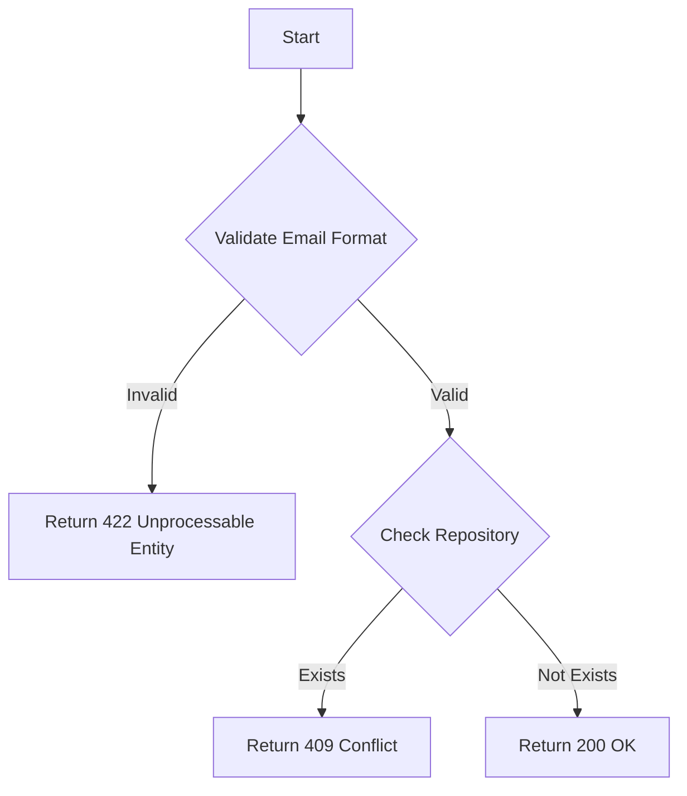

import {MermaidZoom} from '#/components/molecules/MermaidZoom'

## Rules

- The email must be a valid email format.
- If the email already exists in the system, an error is returned.

## Request

- **Method**: `GET`
- **Path**: `/account/check/email/:email`
- **Parameters**:
    - `email`: The email address to check.

## Diagram

<MermaidZoom>

</MermaidZoom>

## Success Case

- **Status**: `200 OK`
- **Body**: Empty

## Error Case

### Email Invalid
- **Status**: `422 Unprocessable Entity`
- **Body**:
```json
{
  "statusCode": 422,
  "message": "Validation failed",
  "error": "Unprocessable Entity"
}
```

### Email In Use
- **Status**: `409 Conflict`
- **Body**:
```json
{
  "statusCode": 409,
  "message": "The provided email \"user@example.com\" is already in use.",
  "error": "Conflict"
}
```
