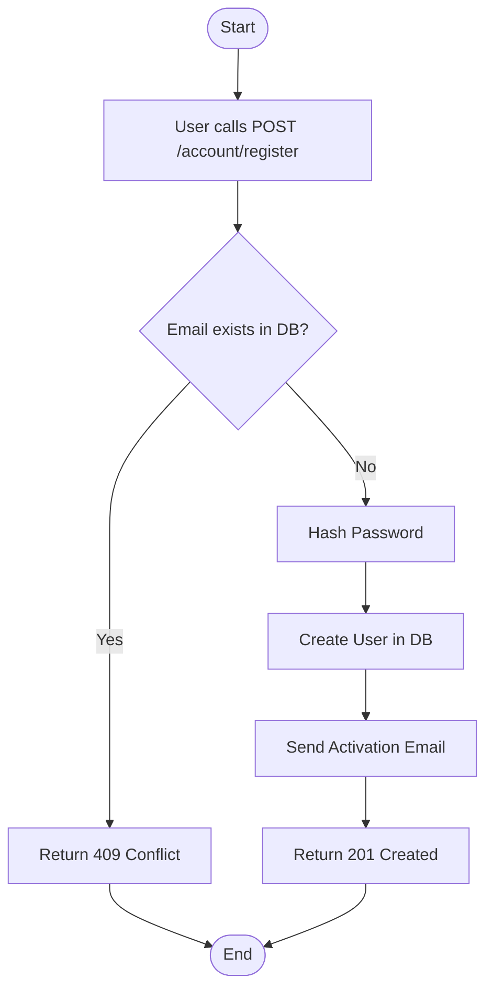

import {MermaidZoom} from '#/components/molecules/MermaidZoom'

## Rules

- The email must be unique in the system.
- The password must meet complexity requirements (e.g., minimum length, special characters).
- The user is created with status `PENDING`.
- An activation email is sent to the user.

## Request

`POST /account/register`

### Body

| Field | Type | Description |
| :--- | :--- | :--- |
| name | string | User's full name |
| email | string | User's email address |
| password | string | User's password (plain text) |

## Diagram

<MermaidZoom>

</MermaidZoom>

## Success Case

`201 Created`

## Error Case

### Email Conflict

`409 Conflict`

```json
{
  "code": "EMAIL_CONFLICT",
  "message": "The email is already in use."
}
```

### Validation Error

`400 Bad Request`

```json
{
  "code": "VALIDATION_ERROR",
  "message": "Invalid password format."
}
```
