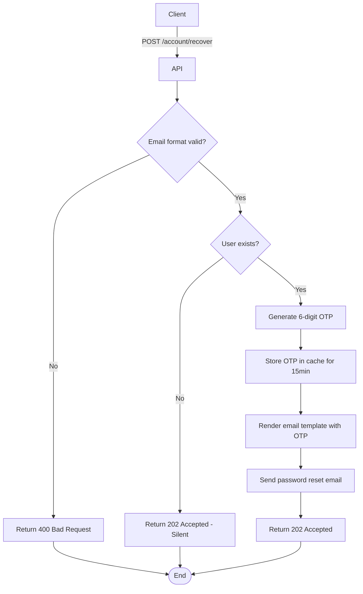

import { MermaidZoom } from '#/components/molecules/MermaidZoom'

## Rules

- The user's email is accepted without revealing if it exists (security against enumeration).
- A new 6-digit OTP is generated and stored in cache with 15-minute expiration.
- A password reset email is sent with a link containing the OTP.
- If the email doesn't exist, the system still returns success (silent fail for security).

## Request

`POST /account/recover`

### Body

| Field | Type | Description |
| :--- | :--- | :--- |
| email | string | User's email address |

## Diagram

<MermaidZoom>

</MermaidZoom>

## Success Case

`202 Accepted`

**Note**: Always returns success even if email doesn't exist (security measure).

## Error Cases

### Validation Error

`400 Bad Request`

```json
{
  "code": "VALIDATION_ERROR",
  "message": "Invalid email format."
}
```
