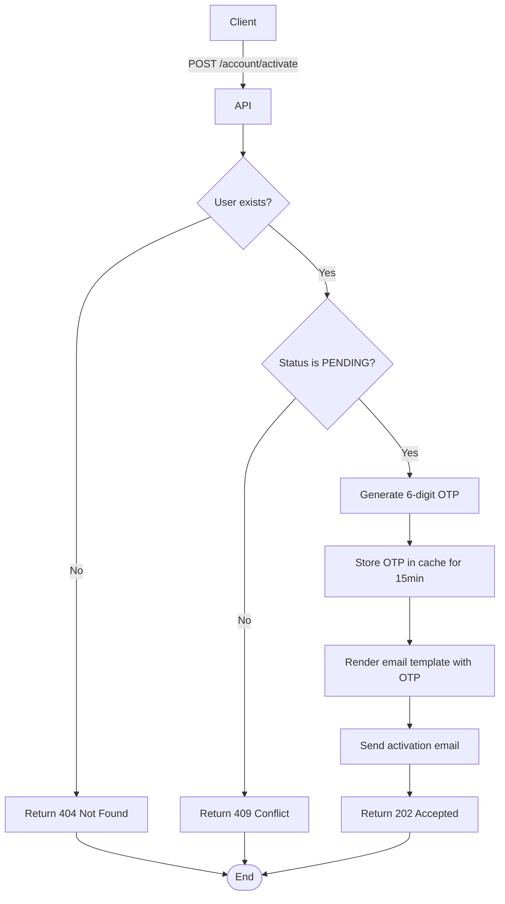

import { MermaidZoom } from '#/components/molecules/MermaidZoom'

## Rules

- The user must exist in the system.
- The user must have status `PENDING` (not already active).
- A new 6-digit OTP is generated and stored in cache with 15-minute expiration.
- An activation email is sent with a link containing the OTP.

## Request

`POST /account/activate`

### Body

| Field | Type | Description |
| :--- | :--- | :--- |
| email | string | User's email address |

## Diagram

<MermaidZoom>

</MermaidZoom>

## Success Case

`202 Accepted`

## Error Cases

### User Not Found

`404 Not Found`

```json
{
  "code": "USER_NOT_FOUND",
  "message": "User not found."
}
```

### User Already Active

`409 Conflict`

```json
{
  "code": "USER_ALREADY_ACTIVE",
  "message": "User is already active."
}
```

### Validation Error

`400 Bad Request`

```json
{
  "code": "VALIDATION_ERROR",
  "message": "Invalid email format."
}
```
