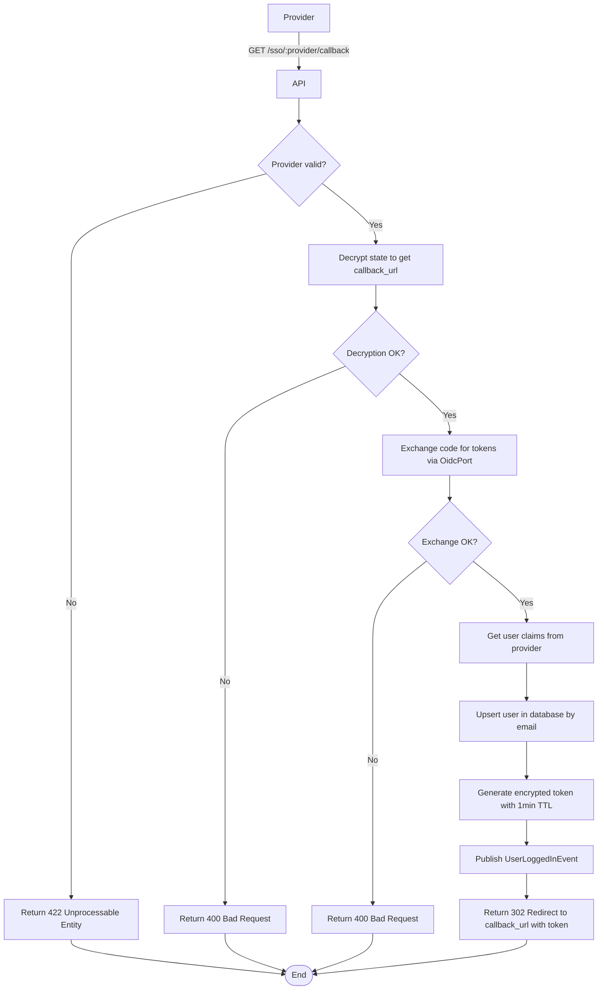

import { MermaidZoom } from '#/components/molecules/MermaidZoom'

## Rules

- Provider must be one of: `google`, `microsoft`.
- The `code` parameter must be a valid authorization code from the provider.
- The `state` parameter contains the encrypted `callback_url` from the initial request.
- User is created if doesn't exist (upsert based on email).
- A temporary encrypted token with 1-minute TTL is generated containing the user ID.
- User is redirected to the decrypted `callback_url` with the token as a query parameter.

## Request

`GET /sso/:provider/callback`

### Path Parameters

| Field | Type | Description |
| :--- | :--- | :--- |
| provider | string | OAuth2 provider (`google` or `microsoft`) |

### Query Parameters

| Field | Type | Description |
| :--- | :--- | :--- |
| code | string | Authorization code from OAuth2 provider |
| state | string | Encrypted callback_url from initial request |

## Diagram

<MermaidZoom>

</MermaidZoom>

## Success Case

`302 Found`

**Headers:**
```
Location: https://yourapp.com/auth/callback?token=<encrypted_user_token>
```

The encrypted token contains:
- `userId`: User's UUID
- `exp`: Expiration timestamp (1 minute from now)

## Error Cases

### Invalid Provider

`422 Unprocessable Entity`

```json
{
  "code": "INVALID_PROVIDER",
  "message": "Provider must be one of: google, microsoft."
}
```

### Invalid or Expired Code

`400 Bad Request`

```json
{
  "code": "INVALID_OAUTH_CODE",
  "message": "Invalid or expired authorization code."
}
```

### Invalid State

`400 Bad Request`

```json
{
  "code": "INVALID_STATE",
  "message": "Unable to decrypt state parameter."
}
```

### Validation Error

`400 Bad Request`

```json
{
  "code": "VALIDATION_ERROR",
  "message": "Missing required parameter: code."
}
```
