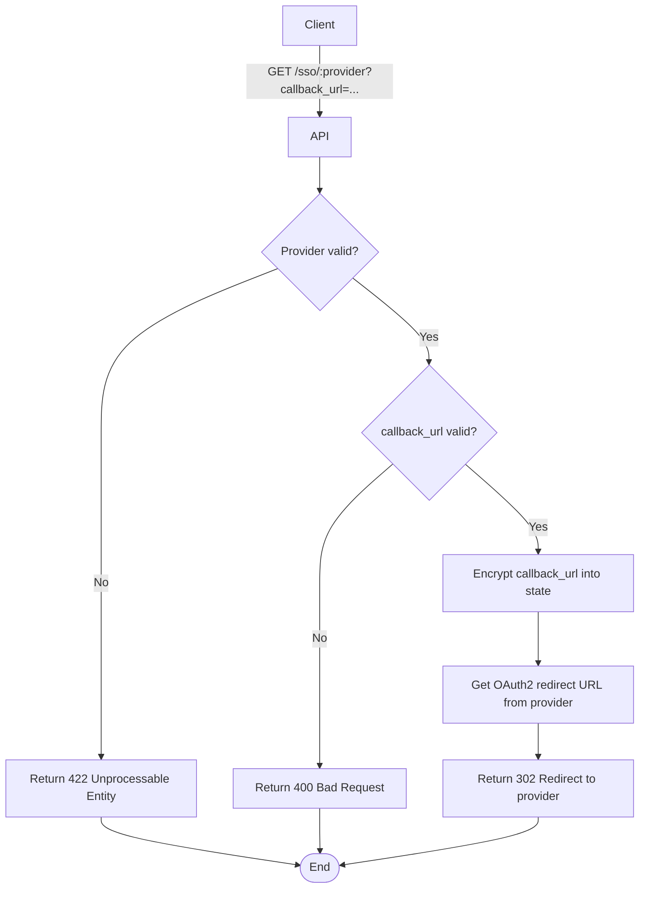

import { MermaidZoom } from '#/components/molecules/MermaidZoom'

## Rules

- Provider must be one of: `google`, `microsoft`.
- The `callback_url` parameter is required and must be a valid URL.
- The `callback_url` is encrypted and stored in the OAuth2 `state` parameter for security.
- The user is redirected to the external provider's authentication page.

## Request

`GET /sso/:provider`

### Path Parameters

| Field | Type | Description |
| :--- | :--- | :--- |
| provider | string | OAuth2 provider (`google` or `microsoft`) |

### Query Parameters

| Field | Type | Description |
| :--- | :--- | :--- |
| callback_url | string | URL where user will be redirected after authentication |

## Diagram

<MermaidZoom>

</MermaidZoom>

## Success Case

`302 Found`

**Headers:**
```
Location: https://accounts.google.com/o/oauth2/v2/auth?client_id=...&redirect_uri=...&state=<encrypted_callback_url>&scope=...
```

## Error Cases

### Invalid Provider

`422 Unprocessable Entity`

```json
{
  "code": "INVALID_PROVIDER",
  "message": "Provider must be one of: google, microsoft."
}
```

### Invalid Callback URL

`400 Bad Request`

```json
{
  "code": "VALIDATION_ERROR",
  "message": "callback_url must be a valid URL."
}
```
