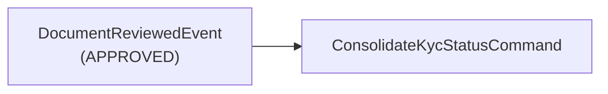

import { MermaidZoom } from '#/components/molecules/MermaidZoom'

## Purpose

Reacts to document review outcomes by consolidating the overall KYC status. When an admin approves a document, this saga triggers the automated verification of whether all KYC requirements have been met.

## Event → Command Mapping

| Listened Event          | Condition                       | Dispatched Command           |
| :---------------------- | :------------------------------ | :--------------------------- |
| `DocumentReviewedEvent` | `documentStatus === APPROVED`   | `ConsolidateKycStatusCommand` |

## Diagram

<MermaidZoom>

</MermaidZoom>

## Details

When an administrator reviews and approves a document (01.29), the saga dispatches the `ConsolidateKycStatusCommand` (01.35). This command checks if all KYC requirements are met (selfie + RG or CNH) and, if so, promotes the KYC status to `APPROVED`, publishing a `UserKycStatusChangedEvent` that triggers Phase 2 of the User Saga.

> [!NOTE]
> Only `APPROVED` document reviews trigger this saga. Rejected documents do not affect the KYC consolidation flow.
