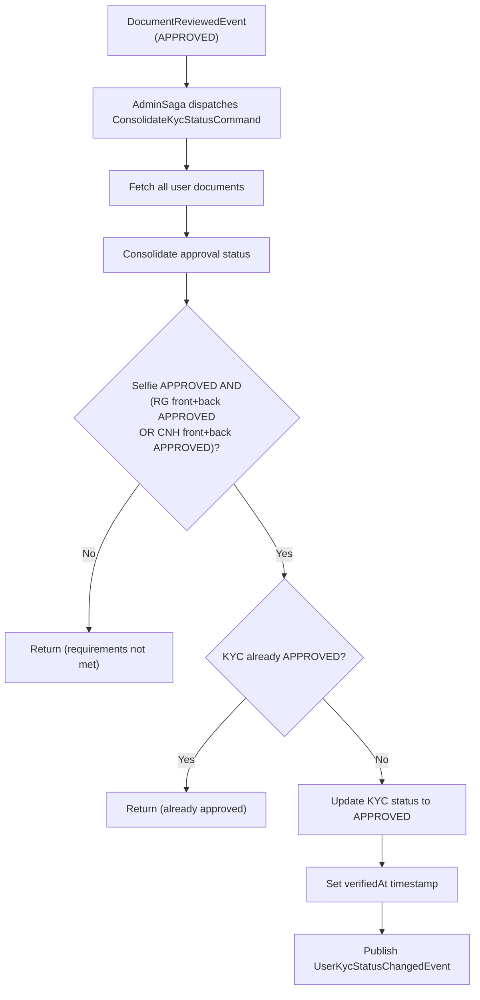

import { MermaidZoom } from '#/components/molecules/MermaidZoom'

> **Acesso**: `⚙️ Internal` — Disparado pela saga `AdminSaga` ao receber `DocumentReviewedEvent` com `documentStatus === APPROVED`.

## Purpose

Evaluates whether all mandatory KYC documents have been approved and, if so, promotes the user's KYC status to `APPROVED`. This bridges the admin document review flow with the user onboarding saga.

## Input

| Field  | Type | Description     |
| :----- | :--- | :-------------- |
| userId | uuid | User identifier |

## Diagram

<MermaidZoom>

</MermaidZoom>

## Side Effects

- Updates `KycEntity.status` to `APPROVED` and sets `verifiedAt`
- Publishes `UserKycStatusChangedEvent` (consumed by `UserSaga` Phase 2)

## Emitted Events

### UserKycStatusChangedEvent

**Tipo**: Não-Auditável

**Payload:**
```json
{
  "correlationId": "...",
  "occurredAt": "...",
  "payload": {
    "userId": "uuid",
    "status": "APPROVED",
    "verifiedAt": "2026-01-01T00:00:00.000Z"
  }
}
```
