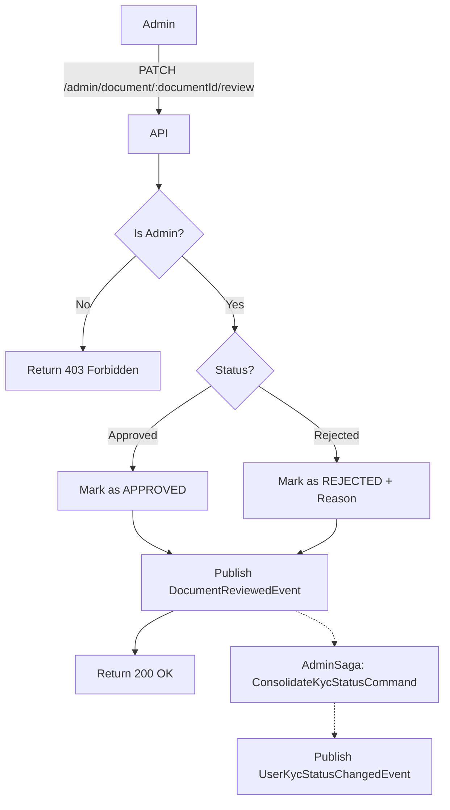

import { MermaidZoom } from '#/components/molecules/MermaidZoom'

## Rules

- **Admin Access**: Only users with ADMIN role can perform this action.
- **Workflow**:
    - **Approve**: Updates document status to `APPROVED`. Publishes `DocumentReviewedEvent`.
    - **Reject**: Updates status to `REJECTED`. Requires a `rejectReason`. Publishes `DocumentReviewedEvent`.
- **KYC Consolidation (via Saga)**: When a document is approved, `AdminSaga` dispatches `ConsolidateKycStatusCommand` to check if all required documents are complete and promote KYC status.
- **Notification**: Triggers an email/notification to the user with the result.

## Request

- **Method**: `PATCH`
- **Path**: `/admin/document/:documentId/review`
- **Body**:

| Field | Type | Description | Required |
| :--- | :--- | :--- | :--- |
| status | string | 'approved' \| 'rejected' | Yes |
| rejectReason | string | Reason for rejection | Conditional (if rejected) |

## Diagram

<MermaidZoom>

</MermaidZoom>

## Success Case

- **Status**: `200 OK`
- **Body**:

```json
{
  "id": "018b7c86-8a9d-72c0-8339-2c7c5a5a7e3d",
  "status": "approved",
  "rejectReason": null,
  "updatedAt": "2024-01-01T12:00:00.000Z"
}
```

## Error Case

- **Status**: `400 Bad Request`
- **Body**:

```json
{
  "correlationId": "uuid-v7",
  "code": "request.validation_error",
  "message": "Reject reason is required when rejecting a document",
  "occurredAt": "2023-01-01T00:00:00.000Z",
  "details": [
    {
      "code": "custom",
      "message": "Reject reason is required when rejecting a document",
      "path": ["rejectReason"]
    }
  ]
}
```

## Emitted Events

### DocumentReviewedByAdminEvent

**Tipo**: 📜 **Auditável** (`REVIEW_DOCUMENT_ADMIN`)

> [!IMPORTANT]
> Este evento é **automaticamente registrado** no audit log (`tb_activity`) vinculado ao **usuário dono do documento**, registrando qual admin realizou a revisão para compliance e rastreabilidade.

**Payload:**
```json
{
  "correlationId": "018f3b5e-1234-7000-8000-000000000000",
  "occurredAt": "2026-02-12T21:00:00.000Z",
  "payload": {
    "documentOwnerId": "018f3b5e-5678-7000-8000-000000000001",
    "documentId": "018f3b5e-doc1-7000-8000-000000000004",
    "previousStatus": "PENDING",
    "newStatus": "APPROVED",
    "reviewerId": "018f3b5e-adm1-7000-8000-000000000099",
    "reviewerDeviceId": "018f3b5e-9999-7000-8000-000000000003",
    "rejectReason": null
  }
}
```

### DocumentReviewedEvent

**Tipo**: Não-Auditável

Disparado para notificar o usuário sobre o resultado da análise do documento.

**Payload:**
```json
{
  "correlationId": "018f3b5e-1234-7000-8000-000000000000",
  "occurredAt": "2026-02-12T21:00:00.000Z",
  "payload": {
    "documentId": "018f3b5e-doc1-7000-8000-000000000004",
    "documentStatus": "APPROVED",
    "documentRejectReason": null,
    "documentUserId": "018f3b5e-5678-7000-8000-000000000001"
  }
}
```

### UserKycStatusChangedEvent _(via Saga)_

**Tipo**: Não-Auditável

Disparado pelo `ConsolidateKycStatusCommand` (via `AdminSaga`) **apenas se** todos os documentos obrigatórios forem aprovados, promovendo o status KYC do usuário para `APPROVED`.

**Payload:**
```json
{
  "correlationId": "018f3b5e-1234-7000-8000-000000000000",
  "occurredAt": "2026-02-12T21:00:00.000Z",
  "payload": {
    "userId": "018f3b5e-5678-7000-8000-000000000001",
    "status": "APPROVED",
    "verifiedAt": "2026-02-12T21:00:00.000Z"
  }
}
```
