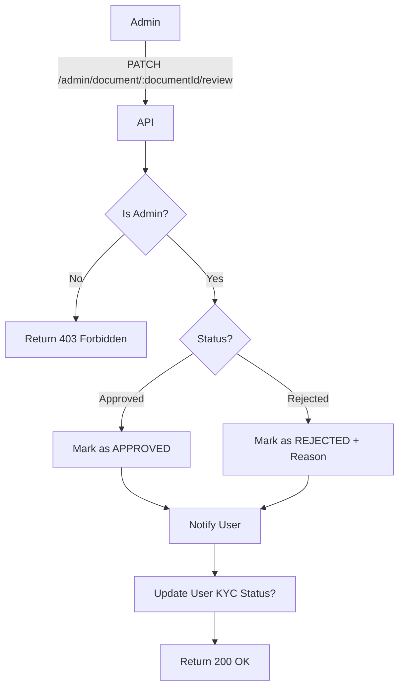

import {MermaidZoom} from '#/components/molecules/MermaidZoom'

## Rules

- **Admin Access**: Only users with ADMIN role can perform this action.
- **Workflow**:
    - **Approve**: Updates document status to `APPROVED`. Checks if all required docs are approved to upgrade user status.
    - **Reject**: Updates status to `REJECTED`. Requires a `rejectReason`.
- **Notification**: Triggers an email/notification to the user with the result.

## Request

- **Method**: `PATCH`
- **Path**: `/admin/document/:documentId/review`
- **Body**:

| Field | Type | Description | Required |
| :--- | :--- | :--- | :--- |
| status | string | 'approved' \| 'rejected' | Yes |
| rejectReason | string | Reason for rejection | Conditional (if rejected) |

## Diagram

<MermaidZoom>

</MermaidZoom>

## Success Case

- **Status**: `200 OK`
- **Body**:

```json
{
  "id": "018b7c86-8a9d-72c0-8339-2c7c5a5a7e3d",
  "status": "approved",
  "rejectReason": null,
  "updatedAt": "2024-01-01T12:00:00.000Z"
}
```

## Error Case

- **Status**: `400 Bad Request`
- **Body**:

```json
{
  "correlationId": "uuid-v7",
  "code": "request.validation_error",
  "message": "Reject reason is required when rejecting a document",
  "occurredAt": "2023-01-01T00:00:00.000Z",
  "details": [
    {
      "code": "custom",
      "message": "Reject reason is required when rejecting a document",
      "path": ["rejectReason"]
    }
  ]
}
```
