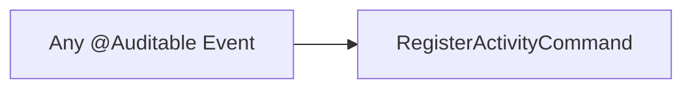

import { MermaidZoom } from '#/components/molecules/MermaidZoom'

## Purpose

Cross-cutting saga responsible for persisting audit trail entries. It listens to **all** domain events decorated with `@Auditable` and automatically creates an activity record in `tb_activity`.

## Event → Command Mapping

| Listened Event                   | Condition                        | Dispatched Command         |
| :------------------------------- | :------------------------------- | :------------------------- |
| Any `DomainEvent`                | Has `@Auditable` decorator       | `RegisterActivityCommand`  |

## Diagram

<MermaidZoom>

</MermaidZoom>

## Details

This saga operates as an infrastructure-level observer. It filters events using the `@Auditable` decorator metadata, extracting the `action` name (e.g., `LINK_WALLET`, `RESET_PASSWORD`, `REVOKE_DEVICE`) and the full event payload as `metadata`.

The `RegisterActivityCommand` (01.36) is dispatched with:
- `action`: The audit action name from the decorator.
- `metadata`: The event payload for traceability.
- `correlationId`: Used as the activity record `id`.
- `occurredAt`: Used as the activity `createdAt` timestamp.

> [!NOTE]
> This saga is **fail-safe**: if the activity persistence fails, the error is logged but the exception is not propagated, ensuring auditing failures never break business flows.
