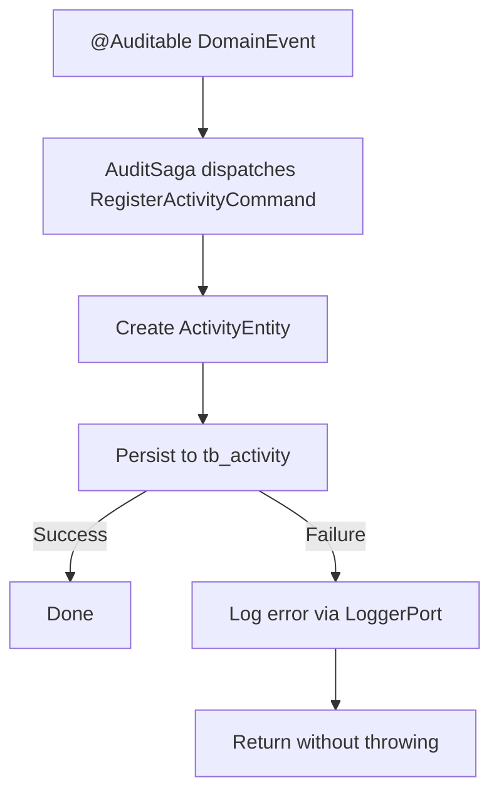

import { MermaidZoom } from '#/components/molecules/MermaidZoom'

> **Acesso**: `⚙️ Internal` — Disparado pela saga `AuditSaga` ao receber qualquer evento decorado com `@Auditable`.

## Purpose

Persists an audit trail entry in `tb_activity` for every auditable domain event. Acts as the single point of audit log creation across the entire system.

## Input

| Field    | Type   | Description                                      |
| :------- | :----- | :----------------------------------------------- |
| action   | string | Audit action name (e.g., `LINK_WALLET`, `RESET_PASSWORD`) |
| metadata | object | Full event payload for traceability               |

## Diagram

<MermaidZoom>

</MermaidZoom>

## Side Effects

- Creates a record in `tb_activity` with:
  - `id` = event's `correlationId`
  - `createdAt` = event's `occurredAt`
  - `action` = decorator's action name
  - `metadata` = event payload

> [!NOTE]
> This command is **fail-safe**: persistence failures are logged but never propagated, ensuring audit errors do not disrupt business operations.
