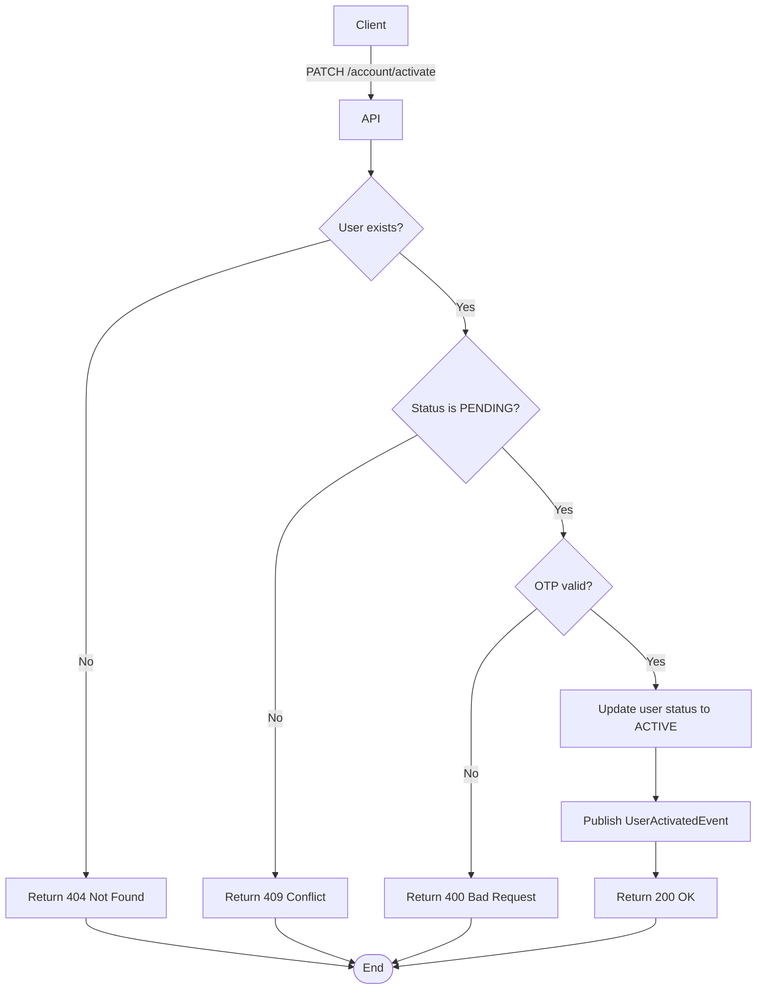

import { MermaidZoom } from '#/components/molecules/MermaidZoom'

## Rules

- The user must exist in the system.
- The user must have status `PENDING` (not already active).
- The OTP code must be valid and not expired (15-minute TTL).
- After activation, user status changes to `ACTIVE`.
- A `UserActivatedEvent` is published to the message broker.

## Request

`PATCH /account/activate`

### Body

| Field | Type | Description |
| :--- | :--- | :--- |
| email | string | User's email address |
| otp | string | 6-digit OTP code received via email |

## Diagram

<MermaidZoom>

</MermaidZoom>

## Success Case

`200 OK`

## Error Cases

### User Not Found

`404 Not Found`

```json
{
  "code": "USER_NOT_FOUND",
  "message": "User not found."
}
```

### User Not Pending

`409 Conflict`

```json
{
  "code": "USER_NOT_PENDING",
  "message": "User is not pending."
}
```

### Invalid OTP

`400 Bad Request`

```json
{
  "code": "INVALID_OTP",
  "message": "Invalid or expired OTP code."
}
```

### Validation Error

`400 Bad Request`

```json
{
  "code": "VALIDATION_ERROR",
  "message": "OTP must be exactly 6 characters."
}
```
