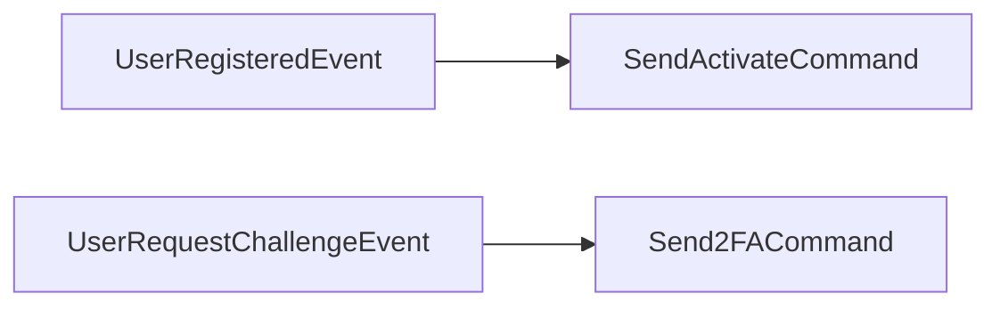

import { MermaidZoom } from '#/components/molecules/MermaidZoom'

## Purpose

Orchestrates automated reactions to authentication-related domain events. It listens for registration and challenge events, dispatching the appropriate email-sending commands.

## Event → Command Mapping

| Listened Event            | Condition | Dispatched Command   |
| :------------------------ | :-------- | :------------------- |
| `UserRegisteredEvent`     | —         | `SendActivateCommand` |
| `UserRequestChallengeEvent` | —       | `Send2FACommand`     |

## Diagram

<MermaidZoom>

</MermaidZoom>

## Details

### UserRegisteredEvent → SendActivateCommand

After a new user registers (01.02), the saga automatically dispatches the activation email command (01.04). This generates an OTP code, stores it in cache with a 15-minute TTL, and sends the activation email with a link containing the OTP as a search parameter.

### UserRequestChallengeEvent → Send2FACommand

When a login attempt triggers a 2FA challenge (01.09, 01.12), the saga dispatches the 2FA code sending command (01.11). This creates a new challenge entity, stores the code, and sends the verification email to the user.
