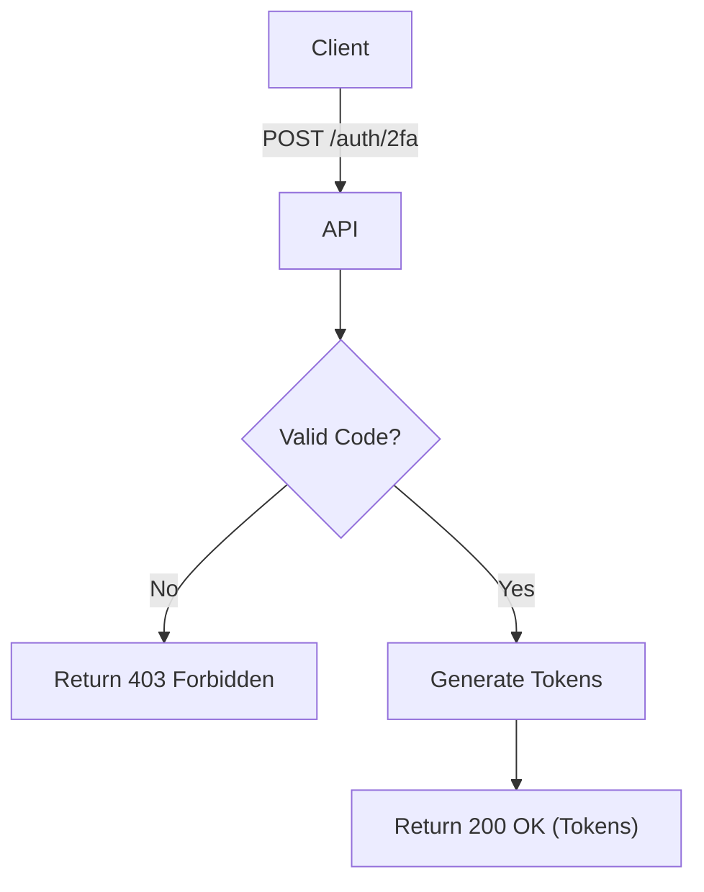

import {MermaidZoom} from '#/components/molecules/MermaidZoom'

## Rules

- User provides `challengeId` (received from login step) and `code` (received via email/app).
- System verifies if the code corresponds to the challenge and is not expired.
- If valid, system generates access and refresh tokens.
- Invalidates the challenge after use.

## Request

- Method: `POST`
- Path: `/auth/2fa`
- Body:
  - `challengeId`: ID of the challenge (required, uuid)
  - `code`: The 2FA code (required, string)

## Diagram

<MermaidZoom>

</MermaidZoom>

## Success Case

- Status: `200 OK`
- Body:
```json
{
  "tokenType": "Bearer",
  "accessToken": "ey...",
  "expiresIn": 3600,
  "refreshToken": "ey..."
}
```

## Error Case

- Status: `403 Forbidden`
- Body:
```json
{
  "statusCode": 403,
  "message": "Invalid or expired code",
  "error": "Forbidden"
}
```
