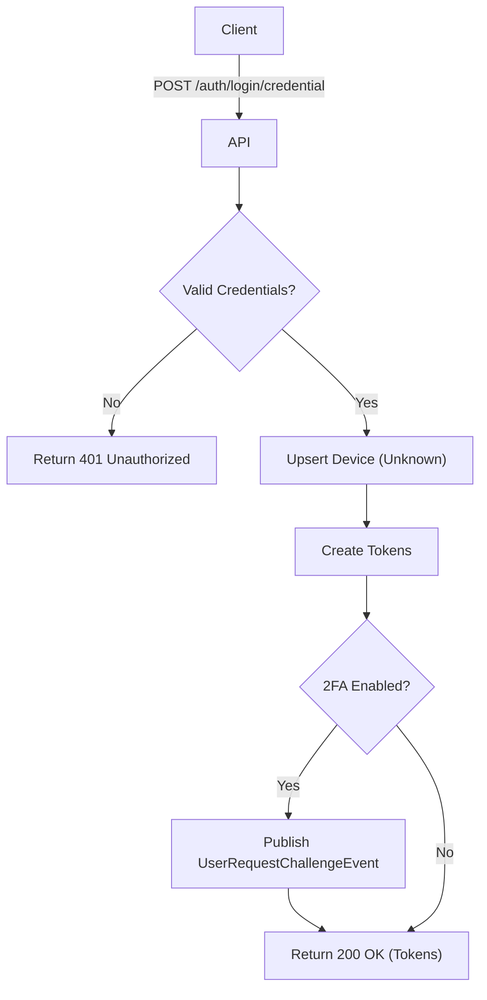

import { MermaidZoom } from '#/components/molecules/MermaidZoom'

## Rules

- 🌎 Public endpoint.
- User provides email and password.
- System verifies credentials.
- System always creates access and refresh tokens.
- **2FA Flow**:
  - If 2FA is enabled (`two_factor_enabled` is true), system emits `UserRequestChallengeEvent`.
  - The client must subsequently handle the challenge verification using the `ChallengeGuard` on protected routes.
- **Device Registration**:
  - Device is registered with `unknown` platform/brand if not already present.
- Logs the login attempt.

## Request

- Method: `POST`
- Path: `/auth/login/credential`
- Body:
  - `email`: User's email (required, email format)
  - `password`: User's password (required, string)
  - `ip`: User's IP address (required, string)
  - `fingerprint`: Device fingerprint (required, string)

## Diagram

<MermaidZoom>

</MermaidZoom>

## Success Case

- Status: `200 OK`
- Body:
```json
{
  "tokenType": "Bearer",
  "accessToken": "ey...",
  "refreshToken": "ey...",
  "expiresIn": 3600
}
```

## Error Case

- Status: `401 Unauthorized`
- Body:
```json
{
  "statusCode": 401,
  "message": "Invalid credentials",
  "error": "Unauthorized"
}
```
