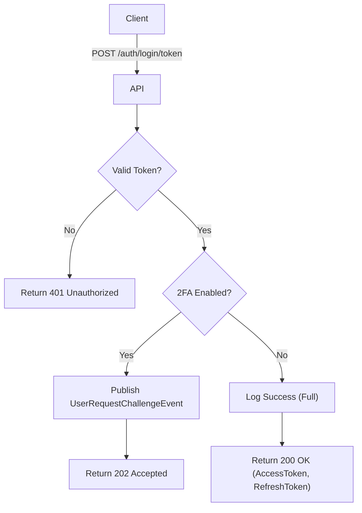

import {MermaidZoom} from '#/components/molecules/MermaidZoom'

## Rules

- User provides a temporary encrypted token (typically from SSO callback).
- System validates and decrypts the token to extract user ID.
- Checks 2FA status for the user.
- If 2FA is enabled, returns challenge token.
- If 2FA is disabled, returns access and refresh tokens.
- Logs the login attempt.

## Request

- Method: `POST`
- Path: `/auth/login/token`
- Body:
  - `token`: Encrypted temporary token (required, string)

## Diagram

<MermaidZoom>

</MermaidZoom>

## Success Case (2FA Disabled)

- Status: `200 OK`
- Body:
```json
{
  "accessToken": "ey...",
  "refreshToken": "ey...",
  "expiresIn": 3600
}
```

## Success Case (2FA Enabled)

- Status: `202 Accepted`
- Body: _Empty_

## Error Case

- Status: `401 Unauthorized`
- Body:
```json
{
  "statusCode": 401,
  "message": "Invalid or expired token",
  "error": "Unauthorized"
}
```
