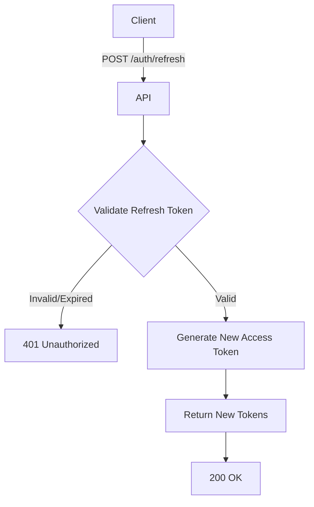

import {MermaidZoom} from '#/components/molecules/MermaidZoom'

## Rules

- 🌎 Public endpoint (No access token required).
- Used to obtain a new access token when the current one expires.
- The refresh token must be valid and not expired.
- The refresh token is typically a long-lived token.
- Refreshing a token does not affect device permissions.

## Request

- **Method**: `POST`
- **Path**: `/auth/refresh`
- **Body**:
  - `refreshToken`: String (The refresh token)

## Diagram

<MermaidZoom>

</MermaidZoom>

## Success Case

- **Status**: `200 OK`
- **Body**:
    ```json
    {
      "accessToken": "ey...",
      "refreshToken": "ey...",
      "expiresIn": 3600
    }
    ```

## Error Case

- **Status**: `401 Unauthorized` (Invalid or expired refresh token)
