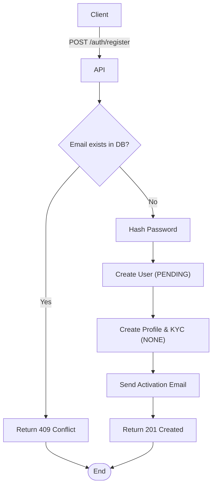

import {MermaidZoom} from '#/components/molecules/MermaidZoom'

## Rules

- 🌎 Public endpoint.
- The email must be unique in the system.
- The password must meet complexity requirements (e.g., minimum length, special characters).
- The user is created with status `PENDING`.
- A basic Profile is created.
- A KYC record is created with status `NONE`.
- An activation email is sent to the user.

## Request

`POST /auth/register`

### Body

| Field | Type | Description |
| :--- | :--- | :--- |
| name | string | User's full name |
| email | string | User's email address |
| password | string | User's password (plain text) |

## Diagram

<MermaidZoom>

</MermaidZoom>

## Success Case

`201 Created`

## Error Case

### Email Conflict

`409 Conflict`

```json
{
  "correlationId": "uuid-v7",
  "code": "user.email_in_use",
  "message": "The email is already in use.",
  "occurredAt": "2023-01-01T00:00:00.000Z"
}
```

### Validation Error

`400 Bad Request`

```json
{
  "correlationId": "uuid-v7",
  "code": "request.validation_error",
  "message": "Invalid password format.",
  "occurredAt": "2023-01-01T00:00:00.000Z"
}
```
