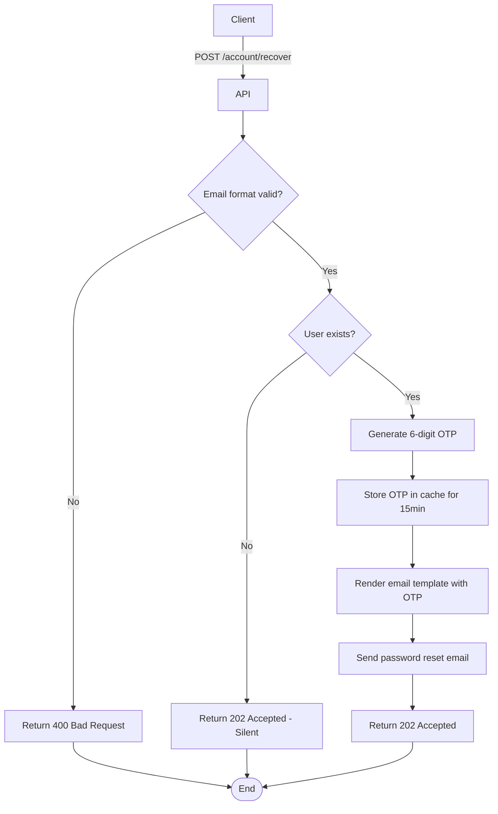

import {MermaidZoom} from '#/components/molecules/MermaidZoom'

## Rules

- 🌎 Public endpoint.
- User submits their email address.
- If the email exists, a 6-digit OTP is generated and sent to the user.
- If the email does not exist, the API returns success (silent failure) to prevent email enumeration.

## Request

`POST /account/recover`

### Body

| Field | Type | Description |
| :--- | :--- | :--- |
| email | string | User's email address |

## Diagram

<MermaidZoom>

</MermaidZoom>

## Success Case

`202 Accepted`

## Error Case

### Validation Error

`400 Bad Request`

```json
{
  "code": "VALIDATION_ERROR",
  "message": "Invalid email format."
}
```
