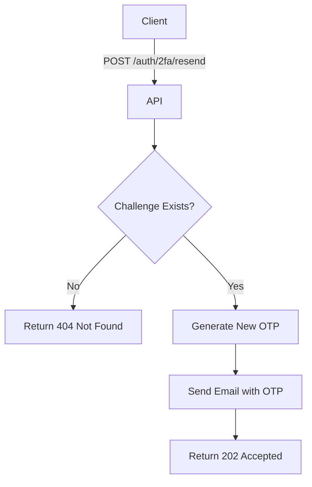

import {MermaidZoom} from '#/components/molecules/MermaidZoom'

## Rules

- User must provide a valid `challengeId`.
- The system generates a new 6-digit OTP for the same user.
- The previous OTP associated with that challenge might be invalidated (depending on security policy), but the `challengeId` context remains.
- The new code is sent via email.
- Returns 202 Accepted.

## Request

- Method: `POST`
- Path: `/auth/2fa/resend`
- Body:
  - `challengeId`: ID of the challenge (required, uuid)

### Example Body

```json
{
  "challengeId": "12345678-1234-1234-1234-123456789012"
}
```

## Diagram

<MermaidZoom>

</MermaidZoom>

## Response

### Success

`202 Accepted`

### Error Cases

#### Challenge Not Found
`404 Not Found`
