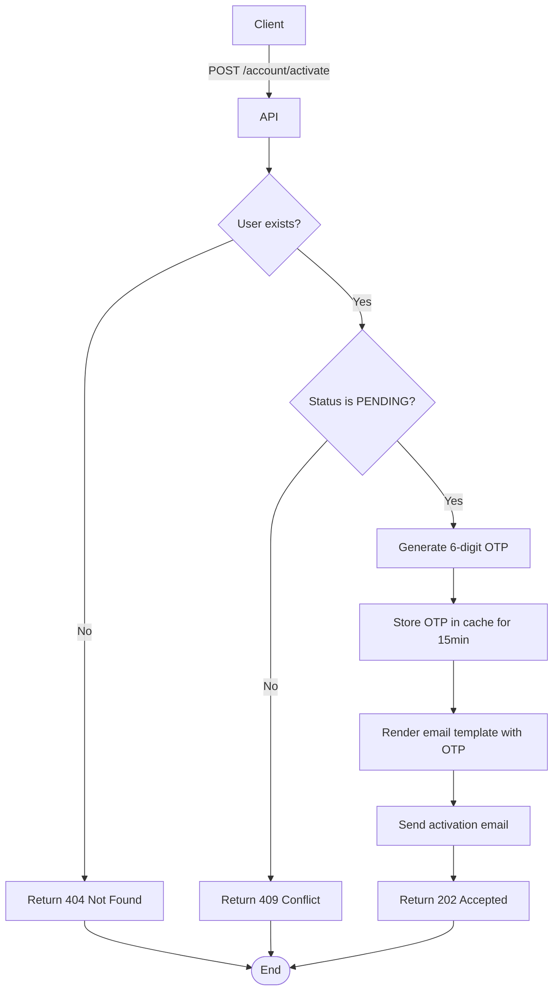

import {MermaidZoom} from '#/components/molecules/MermaidZoom'

## Rules

- User submits their email address.
- If the user exists and status is `PENDING`, a new 6-digit OTP is generated and sent.
- If the user is already `ACTIVE`, a conflict error is returned.
- If the user does not exist, a 404 error is returned (typically).

## Request

`POST /account/activate`

### Body

| Field | Type | Description |
| :--- | :--- | :--- |
| email | string | User's email address |

## Diagram

<MermaidZoom>

</MermaidZoom>

## Success Case

`202 Accepted`

## Error Cases

### User Not Found

`404 Not Found`

### Already Active

`409 Conflict`
