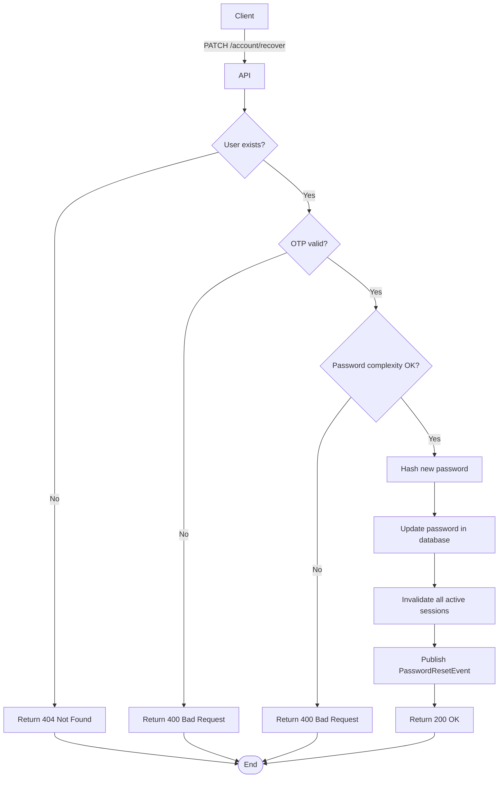

import {MermaidZoom} from '#/components/molecules/MermaidZoom'

## Rules

- 🌎 Public endpoint.
- User provides email, OTP, and new password.
- System validates OTP.
- System validates password complexity.
- Password is hashed and updated in the database.
- All existing sessions are invalidated.

## Request

`PATCH /account/recover`

### Body

| Field | Type | Description |
| :--- | :--- | :--- |
| email | string | User's email address |
| otp | string | 6-digit OTP code |
| password | string | New password |

## Diagram

<MermaidZoom>

</MermaidZoom>

## Success Case

`200 OK`

## Error Cases

### Invalid OTP

`400 Bad Request`

### Weak Password

`400 Bad Request`
