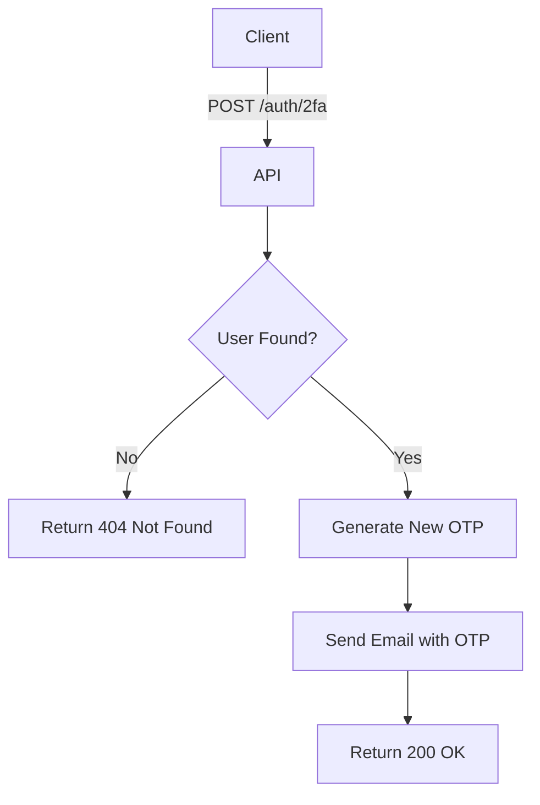

import {MermaidZoom} from '#/components/molecules/MermaidZoom'

## Rules

- 🌎 Public endpoint.
- User provides a valid `email`.
- The system generates a new OTP for the user.
- The new code is sent via email.
- Returns 200 OK.

## Request

- Method: `POST`
- Path: `/auth/2fa`
- Body:
  - `email`: User's email (required, email format)

### Example Body

```json
{
  "email": "john.doe@example.com"
}
```

## Diagram

<MermaidZoom>

</MermaidZoom>

## Response

### Success

`200 OK`

### Error Cases

#### User Not Found
`404 Not Found`
