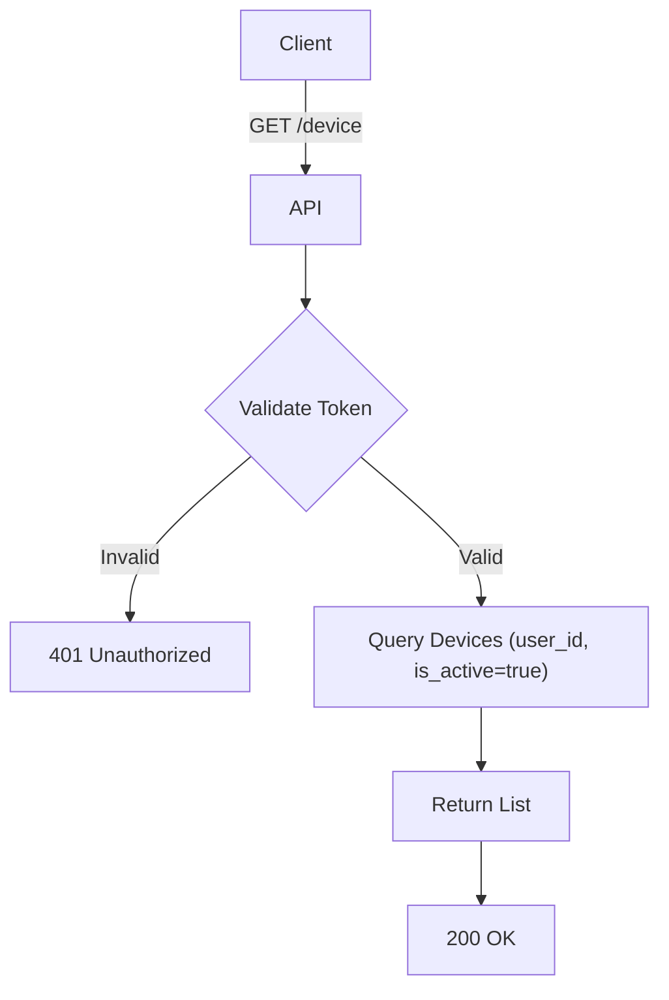

import {MermaidZoom} from '#/components/molecules/MermaidZoom'

## Rules

- 🔒 Requires authentication.
- Lists all devices associated with the user where the session is still valid (`is_active=true`).
- Returns metadata about the device (platform, brand, model, fingerprint, name).

## Request

- **Method**: `GET`
- **Path**: `/device`
- **Headers**:
  - `Authorization`: Bearer `<access_token>`

## Diagram

<MermaidZoom>

</MermaidZoom>

## Success Case

- **Status**: `200 OK`
- **Body**:
    ```json
    {
      "items": [
        {
          "id": "018b6f3c-8c7a-7c9e-8a1d-2b3c4d5e6f7g",
          "platform": "ios",
          "brand": "Apple",
          "name": "My iPhone",
          "model": "iPhone 15",
          "createdAt": "2023-11-20T10:00:00Z"
        },
        ...
      ]
    }
    ```

## Error Case

- **Status**: `401 Unauthorized` (Invalid token)
