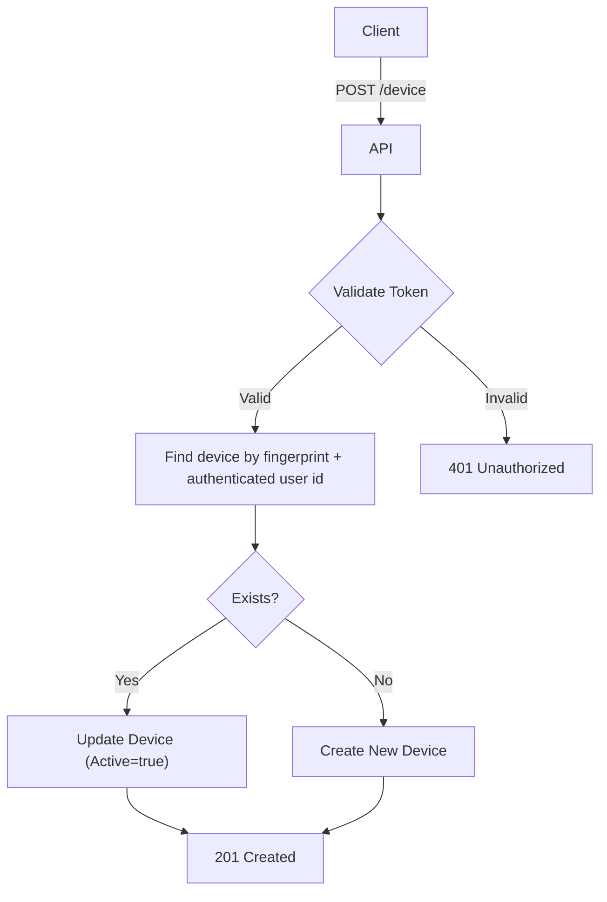

import {MermaidZoom} from '#/components/molecules/MermaidZoom'

## Rules

- 🔒 Requires authentication.
- Registers a user's device for anti-fraud and session monitoring.
- Identification is based on the `fingerprint` and `userId`.
- If a device with the same fingerprint already exists for the user, update the `updatedAt` timestamp and metadata (brand, model).
- If it works, create a new active device record.

## Request

- **Method**: `POST`
- **Path**: `/device`
- **Headers**:
  - `Authorization`: Bearer `<access_token>`
- **Body**:
  - `platform`: Enum (`ios`, `android`, `web`)
  - `fingerprint`: String (unique hash from client)
  - `brand`: String (e.g., Apple, Samsung)
  - `model`: String (e.g., iPhone 15, Galaxy S24)

## Diagram

<MermaidZoom>

</MermaidZoom>

## Success Case

- **Status**: `201 Created`
- **Body**: (Empty)

## Error Case

- **Status**: `400 Bad Request` (Validation error)
- **Status**: `401 Unauthorized` (Invalid token)
