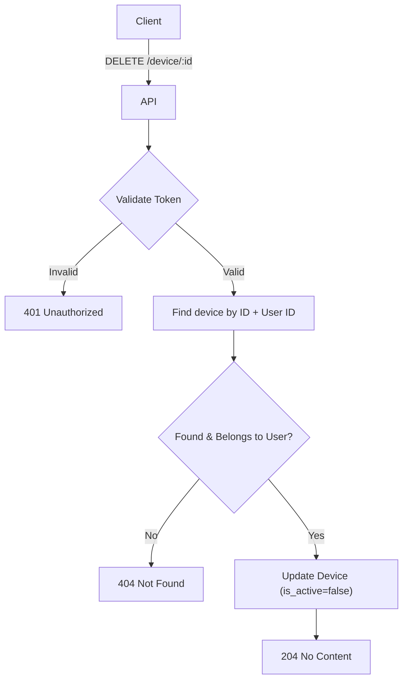

import { MermaidZoom } from '#/components/molecules/MermaidZoom'

## Rules

- 🔒 Requires authentication.
- Inactivates a specific device, preventing new notifications and invalidating its current session.
- Users can only revoke devices that belong to their account.
- Once revoked, the device state is set to `is_active=false`.

## Request

- **Method**: `DELETE`
- **Path**: `/device/:id`
- **Headers**:
  - `Authorization`: Bearer `<access_token>`
- **Params**:
  - `id`: UUIDv7 (Device ID)

## Diagram

<MermaidZoom>

</MermaidZoom>

## Success Case

- **Status**: `204 No Content`
- **Body**: (Empty)

## Error Case

- **Status**: `401 Unauthorized` (Invalid token)
- **Status**: `404 Not Found` (Device not found or does not belong to user)

## Emitted Events

### DeviceRevokedEvent

**Tipo**: 📜 **Auditável** (`REVOKE_DEVICE`)

> [!IMPORTANT]
> Este evento é **automaticamente registrado** no audit log (`tb_activity`) para rastreabilidade de revogação de dispositivos e investigação de segurança.

**Payload:**
```json
{
  "correlationId": "018f3b5e-1234-7000-8000-000000000000",
  "occurredAt": "2026-02-12T21:00:00.000Z",
  "payload": {
    "userId": "018f3b5e-5678-7000-8000-000000000001",
    "deviceId": "018f3b5e-9999-7000-8000-000000000003",
    "reason": "Suspicious activity detected"
  }
}
```
