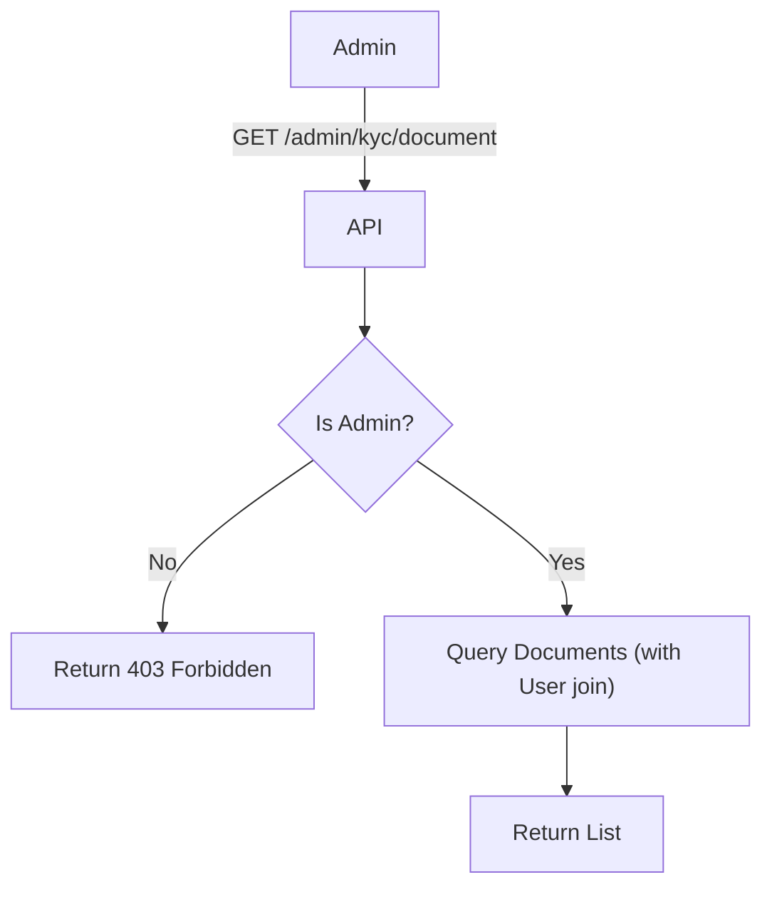

import { MermaidZoom } from '#/components/molecules/MermaidZoom'

## Rules

- **Admin Access**: Requires ADMIN role.
- **Filters**: Status (default: PENDING), Type, Date Range.
- **Pagination**: Paginated results.
- **Data**: Document Info + User Info.

## Request

- **Method**: `GET`
- **Path**: `/admin/kyc/document`
- **Query Params**:
    - `page`: number (default 1)
    - `limit`: number (default 20)
    - `status`: string (default 'pending')
    - `type`: string (optional)

## Diagram

<MermaidZoom>

</MermaidZoom>

## Success Case

- **Status**: `200 OK`
- **Body**:

```json
{
  "items": [
    {
      "id": "018b7c86-8a9d-72c0-8339-2c7c5a5a7e3d",
      "type": "rg_front",
      "status": "pending",
      "createdAt": "2024-01-01T10:00:00.000Z",
      "user": {
        "id": "user-123",
        "name": "John Doe",
        "email": "john@example.com"
      },
      "url": "https://storage.example.com/bucket/doc1?token=..."
    }
  ],
  "total": 50,
  "page": 1,
  "limit": 20
}
```
