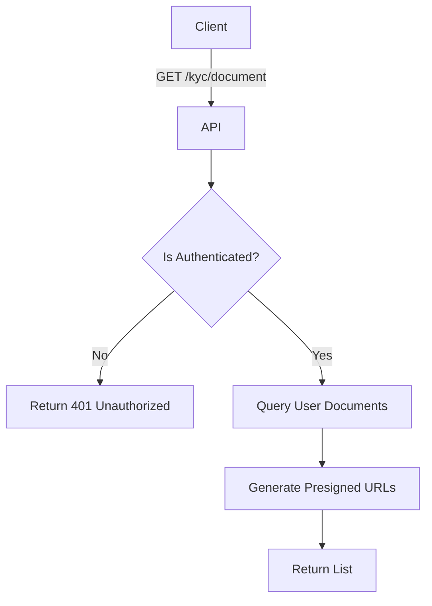

import { MermaidZoom } from '#/components/molecules/MermaidZoom'

## Rules

- **Authenticated Access**: Users can list their own documents.
- **Security**: Returns URLs (often pre-signed with short expiration) for secure file access.
- **Data**: Returns metadata (type, status, reason) and temporary access links.

## Request

- **Method**: `GET`
- **Path**: `/kyc/document`

## Diagram

<MermaidZoom>

</MermaidZoom>

## Success Case

- **Status**: `200 OK`
- **Body**:

```json
{
  "items": [
    {
      "id": "018b7c86-8a9d-72c0-8339-2c7c5a5a7e3d",
      "type": "rg_front",
      "status": "approved",
      "url": "https://storage.example.com/bucket/doc1?token=...",
      "rejectReason": null,
      "createdAt": "2024-01-01T10:00:00.000Z"
    },
    {
      "id": "018b7c87-8a9d-72c0-8339-2c7c5a5a7e3e",
      "type": "rg_back",
      "status": "pending",
      "url": "https://storage.example.com/bucket/doc2?token=...",
      "rejectReason": null,
      "createdAt": "2024-01-01T10:05:00.000Z"
    }
  ]
}
```
