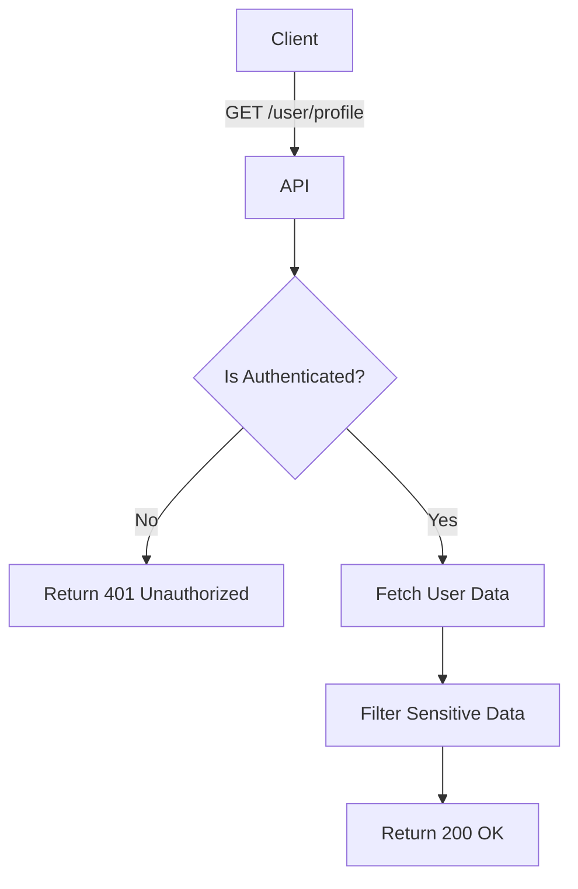

import {MermaidZoom} from '#/components/molecules/MermaidZoom'

## Rules

- **Authenticated Access**: Only authenticated users can retrieve their profile.
- **Data Privacy**: Returns basic profile data, security status (2FA enabled), and KYC status. Does NOT return sensitive secrets (password hash, seed phrase).

## Request

- **Method**: `GET`
- **Path**: `/user/profile`

## Diagram

<MermaidZoom>

</MermaidZoom>

## Success Case

- **Status**: `200 OK`
- **Body**:

```json
{
  "id": "018b7c86-8a9d-72c0-8339-2c7c5a5a7e3d",
  "name": "John Doe",
  "email": "john.doe@example.com",
  "status": "active",
  "kycStatus": "approved",
  "twoFactorEnabled": true,
  "walletAddress": "0x123...",
  "language": "en",
  "timezone": "America/New_York",
  "createdAt": "2024-01-01T10:00:00.000Z",
  "updatedAt": "2024-01-01T12:00:00.000Z"
}
```

## Error Case

- **Status**: `401 Unauthorized`
- **Body**:

```json
{
  "code": "UNAUTHORIZED",
  "message": "Missing or invalid token"
}
```
