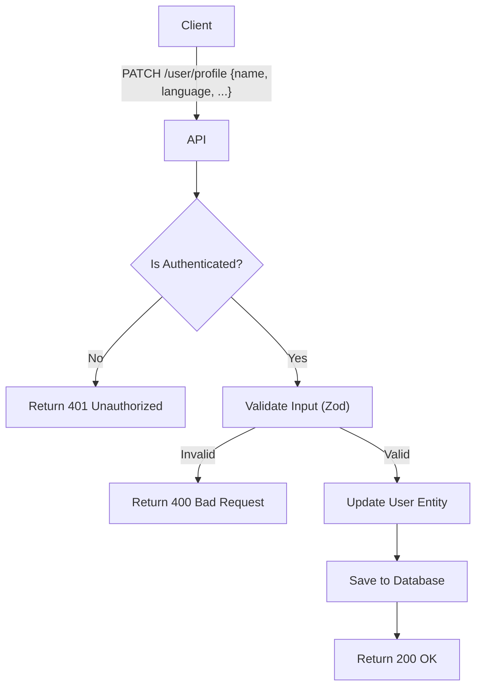

import {MermaidZoom} from '#/components/molecules/MermaidZoom'

## Rules

- **Authenticated Access**: Only authenticated users can update their profile.
- **Critical Fields**: Changing sensitive fields like email or wallet address is NOT allowed through this endpoint.
- **Sanitization**: Inputs (name, language) must be sanitized to prevent injection attacks and ensure data integrity.
- **Validation**:
    - `name`: Max 100 characters.
    - `language`: Must be a valid ISO 639-1 code (e.g., 'en', 'pt').
    - `timezone`: Must be a valid IANA Timezone string (e.g., 'America/Sao_Paulo').

## Request

- **Method**: `PATCH`
- **Path**: `/user/profile`
- **Body**:
    - `name` (optional): string
    - `language` (optional): string
    - `timezone` (optional): string

## Diagram

<MermaidZoom>

</MermaidZoom>

## Success Case

- **Status**: `200 OK`
- **Body**:

```json
{
  "id": "018b7c86-8a9d-72c0-8339-2c7c5a5a7e3d",
  "name": "John Doe",
  "email": "john.doe@example.com",
  "status": "active",
  "kycStatus": "approved",
  "twoFactorEnabled": true,
  "walletAddress": "0x123...",
  "language": "en",
  "timezone": "America/New_York",
  "createdAt": "2024-01-01T10:00:00.000Z",
  "updatedAt": "2024-01-01T12:00:00.000Z"
}
```

## Error Case

- **Status**: `400 Bad Request`
- **Body**:

```json
{
  "code": "VALIDATION_ERROR",
  "message": "Invalid language code",
  "details": ["language must be a valid ISO 639-1 code"]
}
```

- **Status**: `401 Unauthorized`
- **Body**:

```json
{
  "code": "UNAUTHORIZED",
  "message": "Missing or invalid token"
}
```
