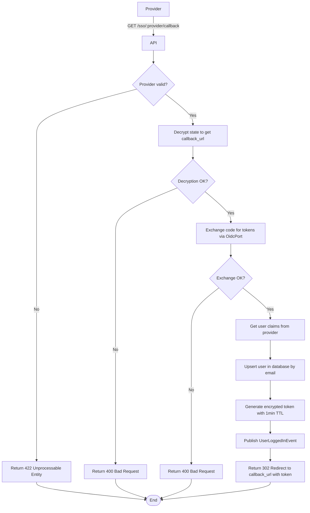

import {MermaidZoom} from '#/components/molecules/MermaidZoom'

## Rules

- 🌎 Public endpoint.
- Provider redirects user back to this endpoint with `code` and `state`.
- System decrypts `state` to retrieve the original `callback_url`.
- System exchanges `code` for tokens (id_token, access_token) via OidcPort.
- System retrieves user info from provider.
- System upserts user in database (by email).
- System generates a temporary encrypted token with 1-min TTL.
- System redirects user to `callback_url` with the temporary token.

## Request

`GET /sso/:provider/callback`

### Parameters

- `provider`: google | microsoft
- `code`: Authorization code from provider
- `state`: Encrypted state containing callback_url

## Diagram

<MermaidZoom>

</MermaidZoom>

## Success Case

`302 Found` (Redirect)

## Error Cases

### Invalid Provider

`422 Unprocessable Entity`

### Invalid State/Code

`400 Bad Request`
