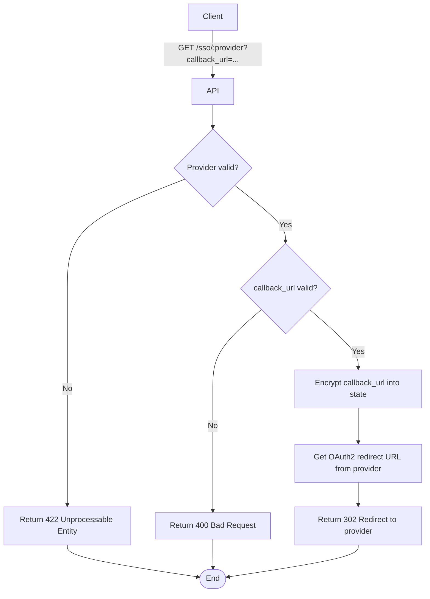

import {MermaidZoom} from '#/components/molecules/MermaidZoom'

## Rules

- 🌎 Public endpoint.
- Client requests SSO login for a provider (google, microsoft).
- Client provides a `callback_url` (where the UI wants to go after login).
- System validates provider and callback_url.
- System encrypts `callback_url` into the `state` parameter.
- System redirects user to the provider's OAuth2 authorization URL.

## Request

`GET /sso/:provider?callback_url=...`

### Parameters

- `provider`: google | microsoft
- `callback_url`: URL to return to after successful login

## Diagram

<MermaidZoom>

</MermaidZoom>

## Success Case

`302 Found` (Redirect)

## Error Cases

### Invalid Provider

`422 Unprocessable Entity`

### Invalid Callback URL

`400 Bad Request`
