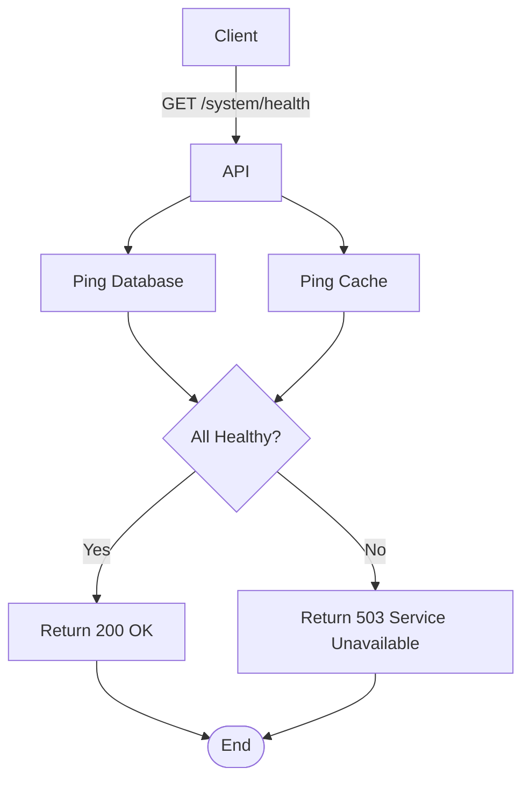

import {MermaidZoom} from '#/components/molecules/MermaidZoom'

## Rules
- 🌎 Public endpoint.
- The system checks all registered `ConnectableContract` implementations.
- Returns `up` and uptime if all connections are healthy.
- Throws `UnhealthyError` (503 Service Unavailable) if any critical connection fails.

## Request
- **Method**: `GET`
- **Path**: `/system/health`

## Diagram

<MermaidZoom>

</MermaidZoom>

## Success Case
- **Status**: `200 OK`
- **Body**:
```json
{
  "uptime": "1d 2h 30m"
}
```

## Error Case
- **Status**: `503 Service Unavailable`
- **Body**:
```json
{
  "correlationId": "uuid-v7",
  "code": "system.unhealthy",
  "message": "Unhealthy",
  "occurredAt": "2023-01-01T00:00:00.000Z"
}
```
