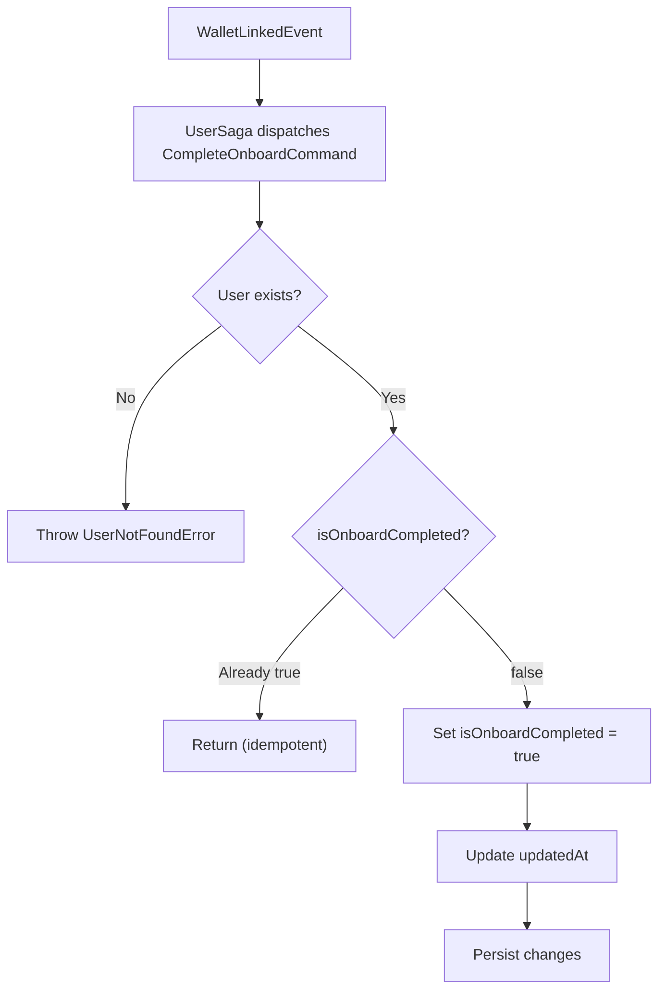

import { MermaidZoom } from '#/components/molecules/MermaidZoom'

> **Acesso**: `⚙️ Internal` — Disparado pela saga `UserSaga` ao receber `WalletLinkedEvent`.

## Purpose

Marks the user's onboarding process as completed. This is the final Phase 3 of the onboarding flow, triggered when the user links their first wallet.

## Input

| Field  | Type | Description     |
| :----- | :--- | :-------------- |
| userId | uuid | User identifier |

## Diagram

<MermaidZoom>

</MermaidZoom>

## Side Effects

- Updates `UserEntity.isOnboardCompleted` to `true`
- Updates `UserEntity.updatedAt` timestamp

> [!NOTE]
> This command is **idempotent** — if `isOnboardCompleted` is already `true`, no changes are made.
