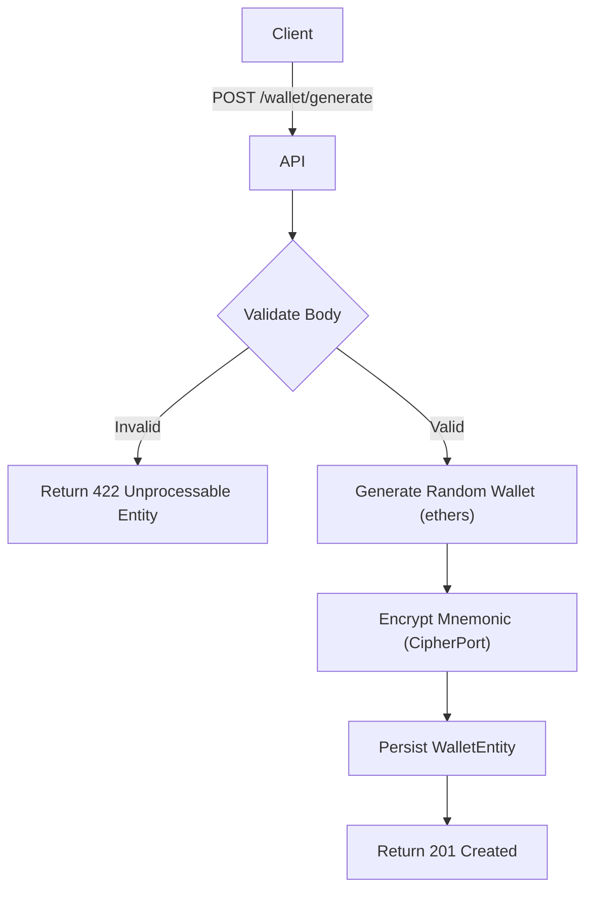

import {MermaidZoom} from '#/components/molecules/MermaidZoom'

## Rules

- **Custodial Creation**: The system generates a new HD Wallet (BIP39) on behalf of the user.
- **Encryption**: The wallet's mnemonic phrase is encrypted using AES-256-GCM with a system-managed key before persistence. This allows the system to automate investment strategies without requiring the user's password for every transaction.
- **Uniqueness**: A user can generate multiple wallets, but the system may impose limits (e.g., max 5 active wallets per user).
- **Network Default**: Currently, all generated wallets default to the Ethereum network.

## Request

- **Method**: `POST`
- **Path**: `/user/wallet/generate`
- **Headers**:
    - `Authorization`: `Bearer <token>`

### Body

```json
{
  "name": "Minha Carteira Principal"
}
```

## Diagram

<MermaidZoom>

</MermaidZoom>

## Success Case

- **Status**: `201 Created`

```json
{
  "id": "018f3b5e-1234-7000-8000-000000000000",
  "address": "0x71C7656EC7ab88b098defB751B7401B5f6d8976F",
  "network": "ethereum"
}
```

## Error Case

- **Status**: `401 Unauthorized`

```json
{
  "correlationId": "uuid-v7",
  "code": "auth.unauthorized",
  "message": "User not authenticated.",
  "occurredAt": "2023-01-01T00:00:00.000Z"
}
```
