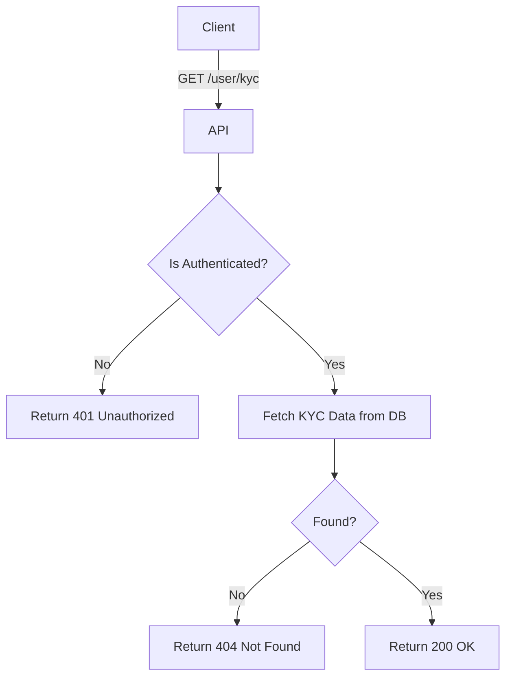

import {MermaidZoom} from '#/components/molecules/MermaidZoom'

## Rules

- **Authenticated Access**: Only authenticated users can retrieve their KYC status.
- **Data Privacy**: Returns detailed KYC status, level, and verification history.
- **Verification Levels**:
    - `TIER_1`: Basic verification (Email/Phone).
    - `TIER_2`: Document verification.

## Request

- **Method**: `GET`
- **Path**: `/user/kyc`

## Diagram

<MermaidZoom>

</MermaidZoom>

## Success Case

- **Status**: `200 OK`
- **Body**:

```json
{
  "id": "kyc_123...",
  "status": "APPROVED",
  "level": "TIER_1",
  "verifiedAt": "2024-01-01T12:00:00.000Z",
  "rejectReason": null,
  "createdAt": "2024-01-01T10:00:00.000Z",
  "updatedAt": "2024-01-01T12:00:00.000Z"
}
```

## Error Cases

- **Status**: `401 Unauthorized`
- **Body**:

```json
{
  "correlationId": "uuid-v7",
  "code": "auth.unauthorized",
  "message": "Missing or invalid token",
  "occurredAt": "2023-01-01T00:00:00.000Z"
}
```

- **Status**: `404 Not Found`
- **Body**:

```json
{
  "correlationId": "uuid-v7",
  "code": "kyc.not_found",
  "message": "KYC record not found",
  "occurredAt": "2023-01-01T00:00:00.000Z"
}
```
