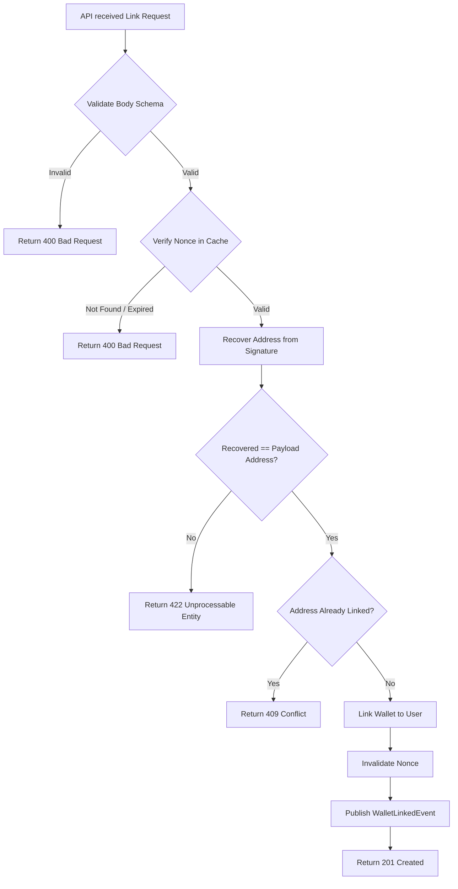

import { MermaidZoom } from '#/components/molecules/MermaidZoom'
import { Web3SignatureDemo } from '#/components/molecules/Web3SignatureDemo'


## Rules

- **Uniqueness**: A wallet address can only be linked to **one** user account. Attempting to link an address already in use by another user will return `409 Conflict`.
- **Proof of Ownership**: The user must prove ownership of the wallet private key by signing a message.
- **Phishing Protection (EIP-4361)**: The message to be signed must follow the EIP-4361 standard, including the domain, address, statement, URI, version, chain ID, nonce, and issued-at timestamp.
- **Nonce Security**: 
  - A cryptographic nonce must be requested from the backend before signing.
  - The nonce is short-lived (TTL) and single-use (invalidated after verification attempt).

## Interactive Demo

The following interactive component demonstrates a web application integration with MetaMask to perform the cryptographic nonce signature.

<Web3SignatureDemo />

## Request

- **Method**: `POST`
- **Path**: `/account/wallet/link`
- **Headers**:
    - `Authorization`: `Bearer <token>`

### Body

```json
{
  "walletAddress": "0x123...",
  "signature": "0x999...",
  "message": "...", // The full EIP-4361 message string that was signed
  "nonce": "abc-123",
  "name": "My Main Wallet"
}
```

## Diagram

<MermaidZoom>

</MermaidZoom>

## Success Case

- **Status**: `201 Created`

```json
{
  "id": "wallet-uuid",
  "address": "0x71C765...d8976f",
  "name": "My Main Wallet",
  "network": "ethereum",
  "linkedAt": "2023-10-27T10:00:00Z"
}
```

## Error Case

- **Status**: `409 Conflict` (Wallet already in use)

```json
{
  "correlationId": "uuid-v7",
  "code": "wallet.already_exists",
  "message": "The wallet address 0x71C... is already linked to another account.",
  "occurredAt": "2023-01-01T00:00:00.000Z"
}
```

## Emitted Events

### WalletLinkedEvent

**Tipo**: 📜 **Auditável** (`LINK_WALLET`)

> [!IMPORTANT]
> Este evento é **automaticamente registrado** no audit log (`tb_activity`) para rastreabilidade de vinculação de carteiras e compliance.

**Payload:**
```json
{
  "correlationId": "018f3b5e-1234-7000-8000-000000000000",
  "occurredAt": "2026-02-12T21:00:00.000Z",
  "payload": {
    "userId": "018f3b5e-5678-7000-8000-000000000001",
    "deviceId": "018f3b5e-9999-7000-8000-000000000003",
    "walletId": "018f3b5e-abcd-7000-8000-000000000002",
    "address": "0x742d35Cc6634C0532925a3b844Bc9e7595f0bEb",
    "network": "ethereum"
  }
}
```
