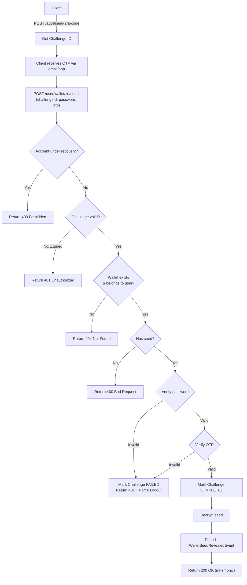

import {MermaidZoom} from '#/components/molecules/MermaidZoom'

## Rules

- 🔒 **Authenticated endpoint** - requires valid access token
- 🔐 **Two-step process** with 2FA Challenge
- 📜 **Auditable action** - every access is logged in `tb_activity`
- **Prerequisites**:
  1. Call `POST /auth/send-2fa-code` to create Challenge → receive `challengeId`
  2. Receive OTP code via email/2FA app
  3. Call this endpoint with `challengeId` + `password` + `otp`
- **Ownership**: Users can only reveal seeds from wallets they own
- **Seed availability**: Only works for internally generated HD wallets
- **Security blocks**:
  - Account under password recovery (active PASSWORD_RESET Challenge)
  - Suspicious behavior detected

## Request

- **Method**: `POST`
- **Path**: `/user/wallet/:walletId/seed`
- **Headers**:
  - `Authorization`: Bearer `<access_token>`
  - `X-Fingerprint`: `<device_id>`

### Body

| Field | Type | Required | Description |
| :--- | :--- | :--- | :--- |
| challengeId | string (UUID) | Yes | Challenge ID from POST /auth/send-2fa-code |
| password | string | Yes | User's current password |
| otp | string | Yes | 6-digit OTP code from email/2FA app |

## Diagram

<MermaidZoom>

</MermaidZoom>

## Success Case

- **Status**: `200 OK`
- **Body**:

```json
{
  "mnemonic": "abandon abandon abandon abandon abandon abandon abandon abandon abandon abandon abandon about",
  "walletId": "018f3b5e-abcd-7000-8000-000000000002"
}
```

> [!CAUTION]
> **Security Warning**: The mnemonic grants complete control over wallet funds. Never share it or store it unencrypted. Frontend will **force logout** on authentication failures.

## Error Cases

### Wallet Not Found

- **Status**: `404 Not Found`

```json
{
  "correlationId": "018f3b5e-1234-7000-8000-000000000000",
  "code": "wallet.not_found",
  "message": "Wallet not found or does not belong to user",
  "occurredAt": "2026-02-12T22:00:00.000Z"
}
```

### Seed Not Available

- **Status**: `400 Bad Request`

```json
{
  "correlationId": "018f3b5e-1234-7000-8000-000000000000",
  "code": "wallet.seed_not_available",
  "message": "Wallet seed is not available (external wallet)",
  "occurredAt": "2026-02-12T22:00:00.000Z"
}
```

### Account Under Recovery

- **Status**: `403 Forbidden`

```json
{
  "correlationId": "018f3b5e-1234-7000-8000-000000000000",
  "code": "account.under_recovery",
  "message": "Account is under password recovery process",
  "occurredAt": "2026-02-12T22:00:00.000Z"
}
```

### Invalid Password/OTP

- **Status**: `401 Unauthorized`
- **Note**: Frontend must force user logout

```json
{
  "correlationId": "018f3b5e-1234-7000-8000-000000000000",
  "code": "user.invalid_credentials",
  "message": "Invalid password or OTP",
  "occurredAt": "2026-02-12T22:00:00.000Z"
}
```

### Challenge Expired

- **Status**: `401 Unauthorized`

```json
{
  "correlationId": "018f3b5e-1234-7000-8000-000000000000",
  "code": "user.invalid_otp",
  "message": "Challenge expired or already used",
  "occurredAt": "2026-02-12T22:00:00.000Z"
}
```

## Emitted Events

### WalletSeedRevealedEvent

**Tipo**: 📜 **Auditável** (`REVEAL_SEED`)

> [!IMPORTANT]
> Este evento é **automaticamente registrado** no audit log (`tb_activity`) para compliance e investigação de segurança. Cada acesso ao seed gera um registro imutável contendo `userId`, `deviceId`, `walletId` e timestamp.

**Payload:**
```json
{
  "correlationId": "018f3b5e-1234-7000-8000-000000000000",
  "occurredAt": "2026-02-12T22:00:00.000Z",
  "payload": {
    "userId": "018f3b5e-5678-7000-8000-000000000001",
    "deviceId": "018f3b5e-9999-7000-8000-000000000003",
    "walletId": "018f3b5e-abcd-7000-8000-000000000002"
  }
}
```
