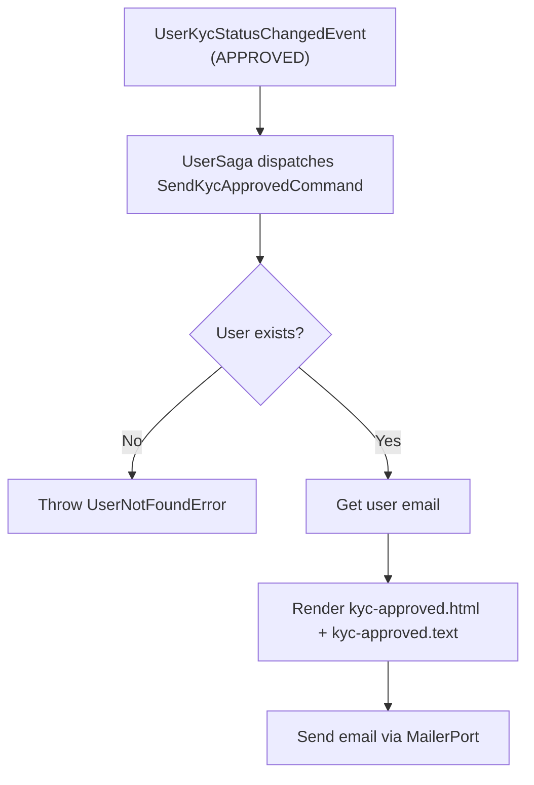

import { MermaidZoom } from '#/components/molecules/MermaidZoom'

> **Acesso**: `⚙️ Internal` — Disparado pela saga `UserSaga` ao receber `UserKycStatusChangedEvent` com `status === APPROVED`.

## Purpose

Notifies the user that their account has been fully verified and they can proceed to link a wallet. This is Phase 2 of the onboarding flow.

## Input

| Field  | Type | Description     |
| :----- | :--- | :-------------- |
| userId | uuid | User identifier |

## Diagram

<MermaidZoom>

</MermaidZoom>

## Side Effects

- Sends email using templates `kyc-approved.html` / `kyc-approved.text` with subject **"Your account has been verified!"**
- Email contains the onboarding URL (`webBaseURL + webOnboardPath`)
