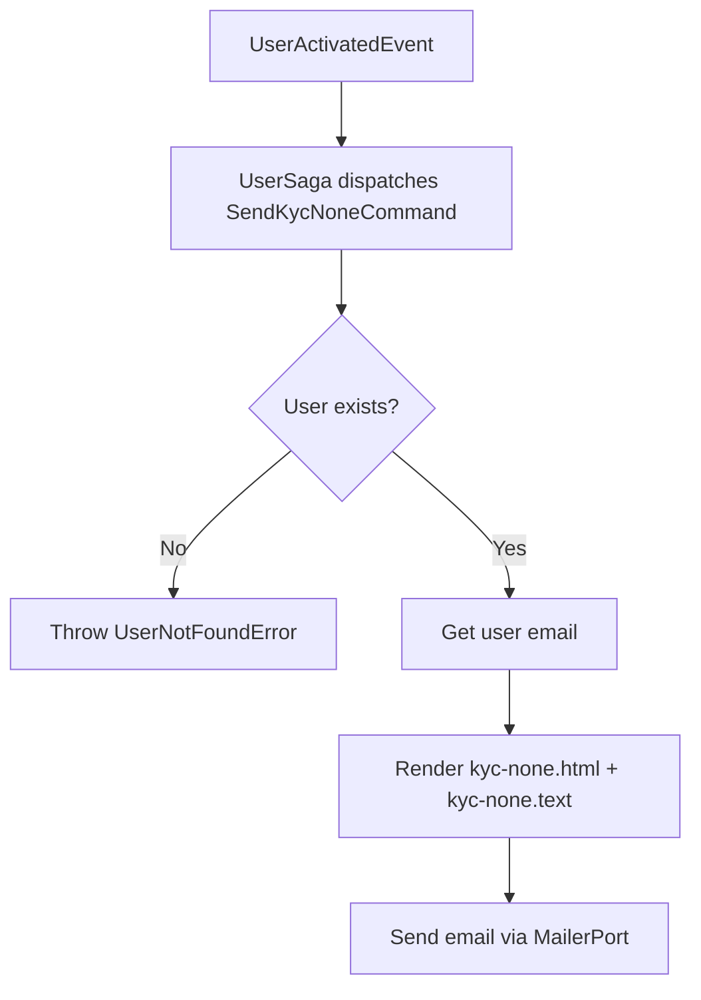

import { MermaidZoom } from '#/components/molecules/MermaidZoom'

> **Acesso**: `⚙️ Internal` — Disparado pela saga `UserSaga` ao receber `UserActivatedEvent`.

## Purpose

Notifies the user that their KYC verification process needs to be started. Dispatched alongside `SendWelcomeCommand` as part of the onboarding Phase 1.

## Input

| Field  | Type | Description     |
| :----- | :--- | :-------------- |
| userId | uuid | User identifier |

## Diagram

<MermaidZoom>

</MermaidZoom>

## Side Effects

- Sends email using templates `kyc-none.html` / `kyc-none.text` with subject **"Start your KYC process"**
- Email contains the onboarding URL (`webBaseURL + webOnboardPath`)
