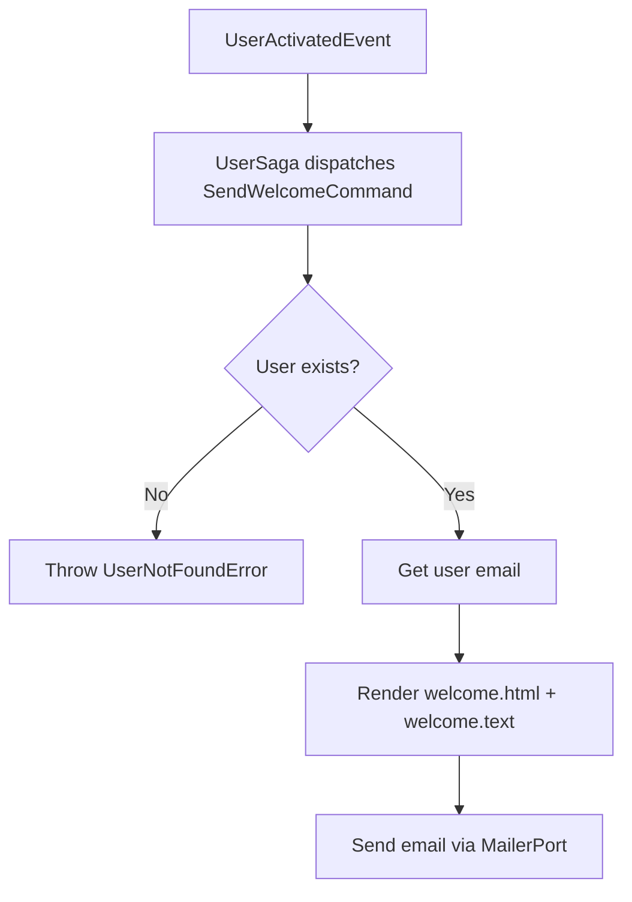

import { MermaidZoom } from '#/components/molecules/MermaidZoom'

> **Acesso**: `⚙️ Internal` — Disparado pela saga `UserSaga` ao receber `UserActivatedEvent`.

## Purpose

Sends a welcome email to the user after account activation, providing a direct link to the onboarding page.

## Input

| Field  | Type | Description     |
| :----- | :--- | :-------------- |
| userId | uuid | User identifier |

## Diagram

<MermaidZoom>

</MermaidZoom>

## Side Effects

- Sends email using templates `welcome.html` / `welcome.text` with subject **"Welcome to Investor!"**
- Email contains the onboarding URL (`webBaseURL + webOnboardPath`)
