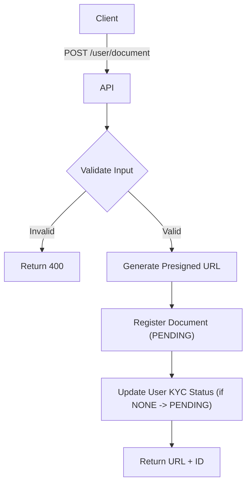

import {MermaidZoom} from '#/components/molecules/MermaidZoom'

## Rules

- **Allowed Formats**: JPG, PNG, PDF.
- **Max Size**: 5MB.
- **Process**:
    1.  User requests upload URL (presigned URL).
    2.  User uploads file directly to storage.
    3.  System registers metadata and updates status.

## Request

- **Method**: `POST`
- **Path**: `/user/document`
- **Body**:

| Field | Type | Description | Required |
| :--- | :--- | :--- | :--- |
| type | string | 'rg_front' \| 'rg_back' \| 'cnh' \| 'selfie' \| 'proof_address' | Yes |
| contentType | string | 'image/jpeg' \| 'image/png' \| 'application/pdf' | Yes |
| size | number | File size in bytes | Yes |

## Diagram

<MermaidZoom>

</MermaidZoom>

## Success Case

- **Status**: `201 Created`
- **Body**:

```json
{
  "id": "018b7c86-8a9d-72c0-8339-2c7c5a5a7e3d",
  "uploadUrl": "https://storage.example.com/bucket/doc1?token=...",
  "expiresAt": "2024-01-01T12:05:00.000Z"
}
```

## Error Case

- **Status**: `400 Bad Request`
- **Body**:

```json
{
  "code": "VALIDATION_ERROR",
  "message": "Invalid file type. Allowed: JPG, PNG, PDF"
}
```
