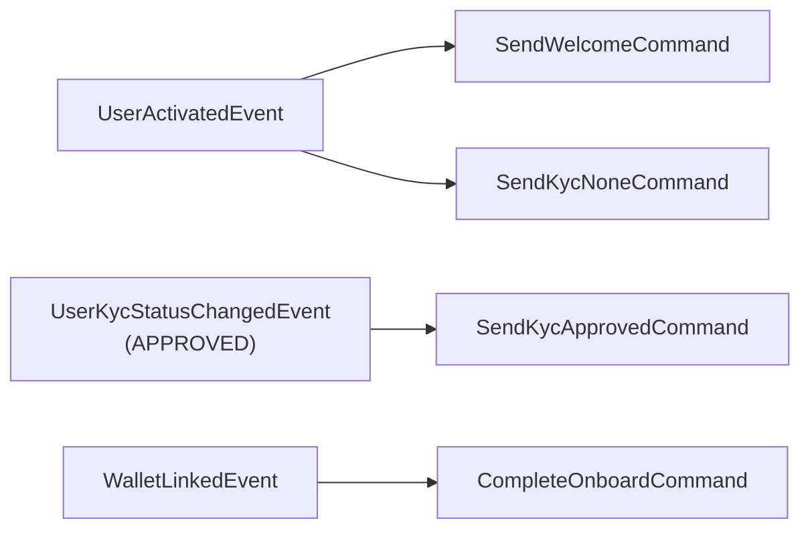

import { MermaidZoom } from '#/components/molecules/MermaidZoom'

## Purpose

Long-running process that orchestrates the entire user onboarding lifecycle — from account activation through KYC approval to wallet linking. It coordinates welcome emails, KYC status notifications, and onboard completion.

## Event → Command Mapping

| Listened Event               | Condition           | Dispatched Command(s)                          |
| :--------------------------- | :------------------ | :--------------------------------------------- |
| `UserActivatedEvent`         | —                   | `SendWelcomeCommand` + `SendKycNoneCommand`    |
| `UserKycStatusChangedEvent`  | `status === APPROVED` | `SendKycApprovedCommand`                     |
| `WalletLinkedEvent`          | —                   | `CompleteOnboardCommand`                       |

## Diagram

<MermaidZoom>

</MermaidZoom>

## Phases

### Phase 1 — Setup (UserActivatedEvent)

When a user activates their account (01.05), the saga dispatches **two commands in parallel**:
- **SendWelcomeCommand** (01.31): Sends a welcome email with the onboarding URL.
- **SendKycNoneCommand** (01.32): Sends an email informing the user to start the KYC verification process.

### Phase 2 — KYC (UserKycStatusChangedEvent)

When the admin approves all required documents and the KYC status changes to `APPROVED` (triggered by 01.35):
- **SendKycApprovedCommand** (01.33): Sends an email notifying the user their account has been verified.

### Phase 3 — Wallet (WalletLinkedEvent)

When the user links their first wallet (01.24):
- **CompleteOnboardCommand** (01.34): Marks `isOnboardCompleted = true` on the user entity, finalizing the onboarding process.
