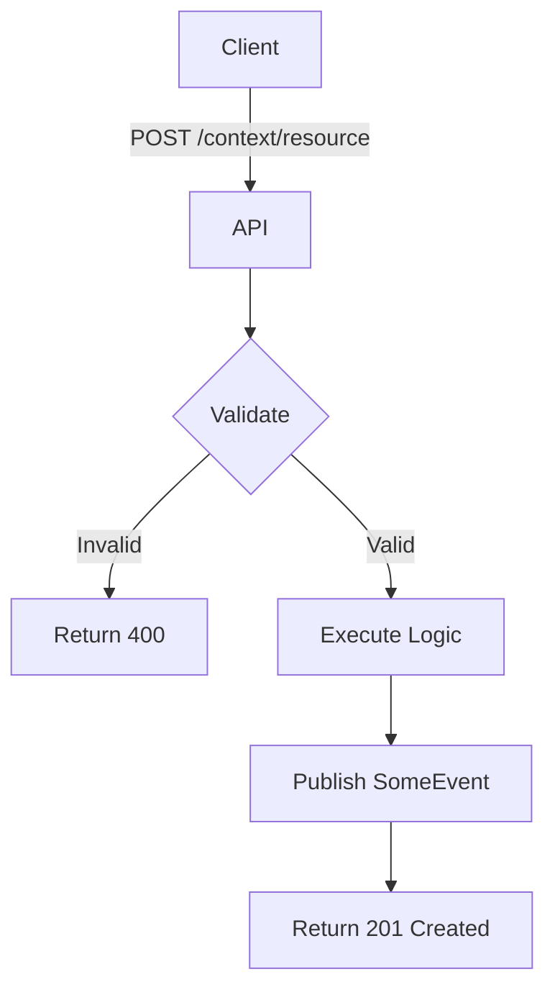
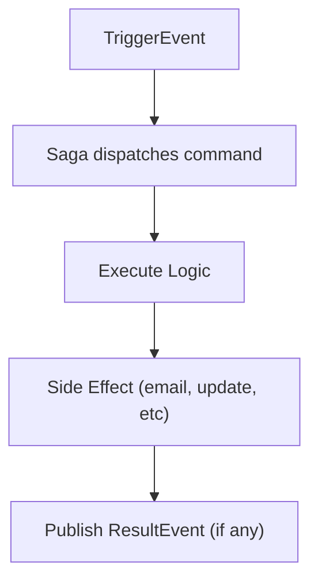
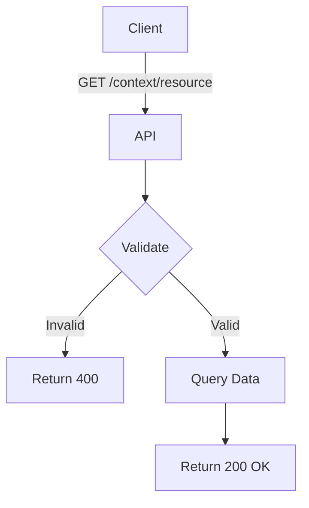
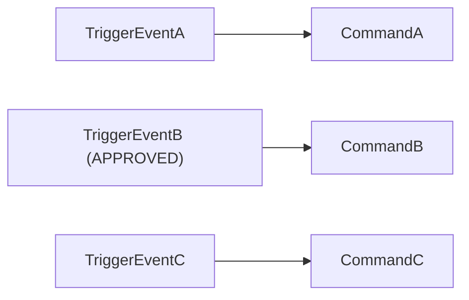

> EXTREMAMENTE IMPORTANTE!: EM TODAS AS ETAPAS NUMERADAS PEÇA A APROVAÇÃO DO USUÁRIO PARA SEGUIR PARA A PRÓXIMA ETAPA

# Prompt de Implementação de Use Case

Este prompt define o fluxo de trabalho para implementar novos casos de uso no projeto. O agente deve seguir rigorosamente as etapas abaixo.

## 1. Análise de Contexto

Antes de iniciar qualquer interação, o agente deve analisar:

*   **Insight que deu origem ao projeto**: @[insight.md] - Entender os motivos da criação do projeto que servira para portifólio demonstrando DDD com NestJS bem aplicado com tracing, events, integração com estruturas externas, documentação e boas práticas
*   **Contexto do Sistema**: @[cs.md] - Identificar quais casos de uso estão pendentes (marcados com `⛔`).
*   **Modelo de Dados**: @[er.mermaid] - Compreender as entidades, relacionamentos e atributos envolvidos.

## 2. Definição do Caso de Uso

O agente deve solicitar ao usuário qual o próximo caso de uso a ser implementado, caso não tenha sido informado. O usuário deve fornecer:
*   Regra de negócio. ex [auth] register user using email and password
*   Cenários de sucesso e falha esperados.

## 3. Inferência de Documentação

Com base no caso de uso definido, o agente deve **inferir** a documentação seguindo o padrão descrito abaixo. Todo command, query e saga deve ser documentado.

*   **Localização**: `apps/doc/src/content/<context>/<command|query>/<use-case>.(command|query).mdx` ou `apps/doc/src/content/<context>/<context>.saga.mdx`. A estrutura de diretórios espelha `apps/api/src/application/` (ignorando `_shared`).
*   **Formato**: MDX com Frontmatter.
*   Existe um componente chamado `<MermaidZoom>` que deve englobar todos os diagramas mermaid. Todos os textos dentro de nós mermaid devem estar entre aspas duplas.
*   Em todo caso de uso que tenha um evento auditável deve informar que aquele evento será transformado em uma activity no audit log.
*   O agente deve apresentar o conteúdo do arquivo `.mdx` proposto ao usuário para aprovação **antes** de criar o arquivo.

<details><summary><strong>3.1 Template: Command HTTP (acessível externamente)</strong></summary><br/>

Para commands que possuem endpoint HTTP associado no controller. Identificar com badge **`🌐 HTTP`** no título.

---
title: "Example Command 🌐"
---
import {MermaidZoom} from '#/components/molecules/MermaidZoom'

> **Acesso**: `🌐 HTTP` — Exposto via endpoint REST.

## Rules

- ...

## Request

- **Method**: `POST`
- **Path**: `/context/resource`
- **Headers**:
    - `Authorization`: `Bearer <token>`

### Body

| Field | Type   | Description | Required |
| :---- | :----- | :---------- | :------- |
| field | string | Description | Yes      |

## Diagram

\<MermaidZoom\>

\</MermaidZoom\>

## Success Case

- **Status**: `201 Created`

```json
{
  "id": "uuid"
}
```

## Error Case

- **Status**: `400 Bad Request`

```json
{
  "correlationId": "uuid-v7",
  "code": "error.code",
  "message": "Error description",
  "occurredAt": "2026-01-01T00:00:00.000Z"
}
```

## Emitted Events

### SomeEvent

**Tipo**: 📜 **Auditável** (`ACTION_NAME`)

**Payload:**
```json
{
  "correlationId": "...",
  "occurredAt": "...",
  "payload": { }
}
```

</details>

<details><summary><strong>3.2 Template: Command Interno (disparado por saga)</strong></summary><br/>

Para commands que não possuem endpoint HTTP — são disparados internamente por uma saga. Identificar com badge **`⚙️ Internal`**.

---
title: "Example Internal Command ⚙️"
---
import {MermaidZoom} from '#/components/molecules/MermaidZoom'

> **Acesso**: `⚙️ Internal` — Disparado pela saga `ContextSaga` ao receber `TriggerEvent`.

## Purpose

Descrição do que o command faz e por que existe.

## Input

| Field  | Type | Description     |
| :----- | :--- | :-------------- |
| userId | uuid | User identifier |

## Diagram

\<MermaidZoom\>

\</MermaidZoom\>

## Side Effects

- Sends email using template `example.html` / `example.text`
- Updates entity field `isCompleted = true`

## Emitted Events

### ResultEvent _(if applicable)_

**Tipo**: Não-Auditável

**Payload:**
```json
{
  "correlationId": "...",
  "occurredAt": "...",
  "payload": { }
}
```

</details>

<details><summary><strong>3.3 Template: Query HTTP</strong></summary><br/>

Para queries que possuem endpoint HTTP. Identificar com badge **`🌐 HTTP`**.

---
title: "Example Query 🌐"
---
import {MermaidZoom} from '#/components/molecules/MermaidZoom'

> **Acesso**: `🌐 HTTP` — Exposto via endpoint REST.

## Rules

- ...

## Request

- **Method**: `GET`
- **Path**: `/context/resource`
- **Headers**:
    - `Authorization`: `Bearer <token>`

## Diagram

\<MermaidZoom\>

\</MermaidZoom\>

## Success Case

- **Status**: `200 OK`

```json
{
  "field": "value"
}
```

## Error Case

- **Status**: `404 Not Found`

```json
{
  "correlationId": "uuid-v7",
  "code": "error.code",
  "message": "Error description",
  "occurredAt": "2026-01-01T00:00:00.000Z"
}
```

</details>

<details><summary><strong>3.4 Template: Saga</strong></summary><br/>

Para sagas que orquestram fluxos entre eventos e commands. Um arquivo por saga.

---
title: "Context Saga"
---
import {MermaidZoom} from '#/components/molecules/MermaidZoom'

## Purpose

Descrição do papel da saga na orquestração do domínio.

## Event → Command Mapping

| Listened Event  | Condition             | Dispatched Command |
| :-------------- | :-------------------- | :----------------- |
| `TriggerEventA` | —                     | `CommandA`         |
| `TriggerEventB` | `status === APPROVED` | `CommandB`         |
| `TriggerEventC` | —                     | `CommandC`         |

## Diagram

\<MermaidZoom\>

\</MermaidZoom\>

</details>

## 4. Implementação na API

Após a aprovação da documentação pelo usuário, o agente deve implementar o caso de uso em @[apps/api] seguindo a arquitetura DDD Layered.

### Arquivos e Estrutura

os diretórios deverão ser perguntados ao usuário

1.  **Use Case (Application Layer)**:
    *   Diretório: `apps/api/src/application/<context>/<command|query|saga>/*.ts`
    *   **Handler** (`<use_case>.ts`): Implementar a lógica de negócio, injetando repositórios e devolvendo erros de domínio ou sucesso. A assinatura deve ser conforme os arquivos em @[apps/api/src/application]
    *   **Validação**: Utilizar a biblioteca *zod* para validar o struct de entrada. Para facilitar mantenha o schema dentro de uma propriedade interna da classe e execute no new da classe como nesse exemplo
        ```ts
        import {Query} from '#/application/_shared/bus';
        import {createClass} from '#/domain/_shared/factories';
        import z from 'zod';
        export class HealthQuery extends Query {}
        export class HealthQueryResult extends createClass(
          z.object({
            uptime: z.string().meta({
              description: 'Application uptime',
              example: '10m 30s',
            }),
          })
        ) {}
        @QueryHandler(HealthQuery)
        export class HealthQueryHandler implements IQueryHandler<HealthQuery, HealthQueryResult> {
            constructor ( ... ) {}
            async execute(query: HealthQuery): Promise<HealthQueryResult> { ... }
        }
        ```
    *   Estamos usando o nestjs para garantir a injeção de dependência então lembre-se dos modules e que eles precisam exportar informações como por exemplo
        ```ts
        const providers = [HealthQueryHandler]

        @Module({
            imports: [ ... ],
            providers,
            exports: providers
        })
2.  **Registro da Rota (Presentation Layer)** _(apenas para commands/queries HTTP)_:
    *   Arquivo: `apps/api/src/presentation/http/<context>/<context>.controller.ts` implementando swagger e prevendo os tipos.
    *   Associar o método HTTP e URL ao do caso de uso criado.
    *   fazer a implementação com injeção direta do (Command|Query)Bus do NestJS, sem extender classe base.
        ```ts
        import {ExampleCommand} from '#/application/example/command';
        import {Controller, Post, Req} from '@nestjs/common';
        import {CommandBus} from '@nestjs/cqrs';
        import {ApiTags} from '@nestjs/swagger';
        import {GetMeta, MapDomainError} from '../_shared/decorator';
        import {RegisterUserBodyDTO, RegisterUserParamsDTO, RegisterUserResultDTO} from './dto';

        @ApiTags('example')
        @Controller('example')
        @MapDomainError([SomeError, HttpStatus.BAD_REQUEST])
        export class ExampleController {
          constructor(private readonly commandBus: CommandBus) {}
          
          @Post('example')
          async postExample(
            @GetMeta() meta: GetMeta,
            @Body() body: RegisterUserBodyDTO,
            @Param() params: RegisterUserParamsDTO
          ): Promise<RegisterUserResultDTO> {
            return await this.commandBus.execute(ExampleCommand.new({...meta, ...body, ...params}));
          }
        }
        ```    
        
        > nota, os DTO's devem ficar em `apps/api/src/presentation/http/<context>/dto/<use-case>.dto.ts` e exportados no `index.ts` do diretório DTO. Não deve existir mais o diretório `request` ou `response` dentro do controller.

        ```ts
        import { ApiProperty } from '@nestjs/swagger';
        import { ApiEntityProperty } from '../../_shared/decorator';
        import { UserEntity } from '#/domain/account/entity';
        import { ExampleCommand } from '#/application/example/command';
        import { createDTO } from '../_shared/factories';

        export class RegisterUserParamsDTO extends createDTO(
          z.object({
             userId: z.uuid()
          })
        ) {}

        export class RegisterUserBodyDTO extends createDTO(
          ExampleCommand.schema.pick({
            email: true,
            password: true,
            language: true,
            timezone: true
          })
        ) {}

        export class RegisterUserResultDTO {
          @ApiProperty({ example: 'uuid', description: 'User ID' })
          id: string;
        }
        ```

        > Nota: estamos usando a versão mais nova do zod (4.3+) onde .email() e .uuid() são expostos fora do escopo de .string() e se usa .enum() invés do .nativeEnum()

## Exemplo de Fluxo

1.  **Agente**: "Analisei o `cs.md`. Qual caso de uso deseja implementar? Ex: `register account`."
2.  **Usuário**: "Quero fazer o register account. Recebe email/senha, cria conta, retorna 201."
3.  **Agente**: "Proponho a seguinte documentação em `apps/doc/src/content/auth/command/register-user.command.mdx`: [Conteúdo MDX]. Aprova?"
4.  **Usuário**: "Sim."
5.  **Agente**: "Implementando `<context>/application/<query|command>/<use-case>.ts`. Analise se ficou como esperado"
6.  **Usuário**: "Sim."
7.  **Agente**: "Implementando `<context>/presentation/http/<context>.controller.ts`." com os modelos de request no `apps/api/src/presentation/http/<context>/dto/` (usando index.ts). Analise se ficou ok
8.  **Usuário**: "Sim."


---
**Nota**: Mantenha a consistência com os padrões de código (Go para backend, Typescript/MDX para docs) e nomenclaturas existentes no projeto e não esqueça de escrever código, comentários e documentação em inglês.

**OBSERVAÇÃO:** ESSE IMPLEMENTATION PLAN NÃO DEVE SER MODIFICADO ELE É A REFERENCIA DE COMO DEVE SER FEITO